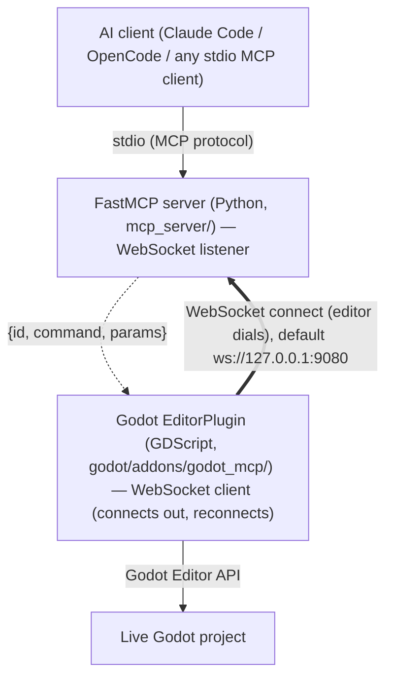

# CLAUDE.md

This file provides guidance to AI agent harnesses (OpenCode and any MCP-capable client) when working with code in this repository.

## Current state

The planned ecosystem is **feature-complete**: the engine (scaffold #1, addon + dock #2, bridge #3, server #4, inspection #5, safety #14, mutation #6, scripts #10, `godot://` resources #11, runtime loop #13, toolset gating #26) plus every content domain and capability — physics #41, animation #39, 3D scene #40, particles #42, navigation #43, audio #44, tilemap #45, theme/UI #46, shaders #47, the runtime session bridge #66 (live inspection #35, input sim #36 + recording #68, profiling #38), play-testing/QA #37, batch refactor #48, static analysis #49, and export #50 — are merged. TileSet authoring #82 and MeshLibrary authoring #83 add the resource-authoring tools that let the tilemap and gridmap surfaces place real content. 175 tools across 29 categories — always-on `core` plus 28 toggleable toolsets, of which only `inspection` is enabled by default (the other 27 gated off). New work now means new GitHub issues; the issues remain the authoritative spec, so read the relevant one before implementing. `docs/tool-contracts.md` is the source of truth for the current tool surface.

**godot-mcp is a generic, game-agnostic Godot MCP server.** It exposes Godot editor capabilities (inspection, scene mutation, scripts, runtime) over MCP — it has no built-in game vocabulary. Any specific game (e.g. a tower-defense roguelite) is a **separate project** that consumes this server; its domain models, semantic tools, and prompts live in that project, not here.

## Grounding rules

The constitutional rules live in `.opencode/rules/` and are the source of truth for *how* to build here. Each is path-scoped (frontmatter `paths:`) so it surfaces on the files it governs. Read the relevant rule before writing code in that area:

| Rule | Article | Governs |
|------|---------|---------|
| `architecture.md` | I & II | Library-first; the addon/server boundary (only the addon touches Godot, only the server owns safety) |
| `mcp-tools.md` | VI + safety | Tool/resource/prompt contract; safety classes, `dry_run`/`confirm`, preconditions |
| `error-handling.md` | IV | The versioned JSON envelope (`{id, ok, result, error, hint}`); structured errors |
| `async-patterns.md` | V | Async FastMCP; bridge timeouts, reconnect/backoff, `id` correlation |
| `addon.md` | — | GDScript addon: `@tool`, command router, UndoRedo, JSON-safe serialization, `type_coerce.gd` |
| `testing.md` | III | TDD; contract→integration→unit; suite health (zero skips) |
| `workflow.md` | — | Issue → red test → green → preflight → PR → merge pipeline |
| `enforcement.md` | IX | Gates, PR checklist, CalVer |
| `graphify.md` | — | Graphify LLM-extraction policy: always run graphify via `scripts/graphify.sh` so the repo `.env` (local ollama backend/model) is observed |

Adapted from the [hybridindie/instructions-and-rules](https://github.com/hybridindie/instructions-and-rules) harness, pared to this project: no frontend/database/Copilot-mirror rules (none apply), with an addon rule added for the GDScript half.

## What this is

A two-part system for **AI-driven Godot development**: an AI client (Claude Code and OpenCode are the primary targets; any stdio MCP client works) drives a live Godot editor through an MCP server. It is **game-agnostic** — generic Godot editor control, not tied to any one game. The repo deliberately keeps a clean boundary between the two halves.

## Architecture

The defining feature is a **four-layer transport chain** (issue #3). Every agent action crosses all four layers:



The editor **dials** the connection (bold) and reconnects; the server still **initiates every command** (dashed). The bridge inversion (#276) changed only who connects, not the request/response direction.

- **MCP server** (`mcp_server/`, Python 3.11+, FastMCP) — the AI-facing entry point over stdio. Exposes **tools**, **resources** (`godot://...` URIs, issue #11), and **prompts** (workflow templates, issue #12). It owns all safety/permission logic and Pydantic domain models; it holds **no** Godot logic itself — it forwards to the addon over the WebSocket bridge.
- **Godot addon** (`godot/addons/godot_mcp/`, GDScript, Godot 4.4+) — an `EditorPlugin` (`@tool`) whose `WebSocketPeer` **client** connects out to the server's bridge listener and reconnects with backoff (#276), routes incoming command envelopes to `cmd_*` handlers that call the Godot Editor API, and shows a status dock. This is the *only* layer that touches Godot.

A typical MCP tool is a thin wrapper: validate/typed-schema in Python → `bridge.send("cmd_name", params)` → addon `cmd_name` handler → JSON result back up the chain. When adding a capability you almost always implement **both** sides (issues tagged `[Both]`): the GDScript `cmd_*` handler and the FastMCP tool that routes to it.

### Planned layout (issue #1)

```
godot/addons/godot_mcp/    plugin.cfg, godot_mcp.gd (EditorPlugin), dock, cmd_* handlers, type_coerce.gd
mcp_server/                main.py (stdio entrypoint), tools/, resources/, prompts/, models/ (Pydantic)
docs/                      architecture.md (bridge contract), tool-contracts.md
```

## Cross-cutting conventions

These span many files and are the things easiest to get wrong:

- **JSON envelopes** (issue #3) — versioned from day one. Command: `{ id, command, params }`. Response: `{ id, ok, result, error }`. Requests correlate by `id`. The addon (WebSocket client) reconnects to the server's listener with exponential backoff (#276); `cmd_ping`→`{pong}` is the health check.
- **Structured errors, never stack traces** — failures return `{ ok: false, error, hint }`. Preconditions return a richer form: `{ ok: false, error: "PRECONDITION_FAILED", hint, required }` (issue #14). Errors must be actionable for an agent with no human in the loop.
- **Tool safety classes** (issue #14) — every tool is tagged `read_only` | `mutating` | `destructive` | `runtime`. `mutating`/`destructive` tools take `dry_run: bool = False`; `destructive` tools require `confirm=True`. Common preconditions: `require_active_scene`, `require_bridge_connected`, `require_node_exists(path)`. All safety logic lives in the MCP layer, **not** the addon.
- **UndoRedo for every mutation** (issue #6) — all create/rename/delete/set operations in the addon must register with `EditorUndoRedoManager`.
- **JSON-safe serialization** — the scene tree and node properties must serialize to JSON-safe types only (no Godot objects). Large trees support a `max_depth` parameter.
- **Type coercion** (issue #6) — Godot types (`Vector2/3`, `Color`, `Rect2`, `NodePath`) are coerced to/from JSON in a dedicated `type_coerce.gd` helper, not inline.
- **Read-only vs. mutating split** — read-only context is exposed both as tools (issue #5) and as `godot://` resources (issue #11); mutations only ever go through tools.
- **Naming** — `snake_case` for all domain/data fields and Pydantic models; addon command handlers are `cmd_<verb>_<noun>`. Every MCP tool is exposed as `godot_<toolset>_<action>` (issue #224) — the prefix *is* the gating toolset (always-on `core`/meta tools are `godot_<action>`); the mapping is applied centrally in `mcp_server/transforms.py` (via FastMCP 4.0's `ToolTransform`, issue #312) and enforced by `tests/contract/test_tool_transform.py`.

## Game-agnostic scope

godot-mcp deliberately ships **no** game vocabulary — no Tower/Enemy/Wave models, no `create_tower`-style tools or prompts. Its surface is generic Godot: inspection, scene mutation, scripts, resources, and runtime control. A specific game (a tower-defense roguelite is the first consumer) is a **separate project** that imports godot-mcp as an MCP server and layers its own domain models, semantic tools, and prompts on top. Keep that boundary: if a capability only makes sense for one game, it belongs in the game project, not here.

## Toolchain & running

The scaffold (issue #1) is in place: `uv`-managed Python package, the addon under `godot/`, docs, and CI.

- Godot **4.4+** (floor), **validated on 4.7-stable** (the `godot/` project declares `config/features=PackedStringArray("4.7")`); Python **3.11+**; **FastMCP 4.0** (PrefectHQ/fastmcp, pinned to the 4.0 beta), managed with **uv**. Always verify Godot APIs against the current docs for the pinned version (via `context7` or `docs.godotengine.org`) rather than from memory — see [[addon]].
- **Dev commands** (run from repo root, mirrored by `.github/workflows/ci.yml`):
  - `uv sync` — create the venv and install runtime + dev deps.
  - `uv run pytest -q` — full suite; single file `uv run pytest tests/unit/test_smoke.py`; single test `uv run pytest tests/unit/test_smoke.py::test_version_is_calver`.
  - `uv run ruff check .` — lint; `uv run mypy` — type check.
  - `./.opencode/hooks/check-no-skipped-tests.sh` — zero-skip suite-health gate.
- Server entrypoint: `uv run godot-mcp` runs the live FastMCP server over stdio (or HTTP via `GODOT_MCP_TRANSPORT=http`, default `127.0.0.1:9090`). `godot_health_check`, `godot_get_server_info` (capability snapshot), and the toolset-gating tools are all shipped.
- The addon is enabled via Godot's *Project Settings → Plugins* (open the `godot/` folder as a project); the addon connects out to the server's bridge listener (default `ws://127.0.0.1:9080`, configurable via `GODOT_MCP_BRIDGE_URL` on both sides) and reconnects automatically. No auth in v1 (localhost-only).
- Clients register the server as a local stdio MCP command: Claude Code via `.mcp.json` / `claude mcp add`, OpenCode via `opencode.json` (concrete examples in `README.md`).

## Output and Responses
- For implementation tasks: output code blocks only, no prose
- For process tasks (branching, PRs, test results, summaries): use bullet points, no prose paragraphs.
- For mandatory reports (e.g. missing tooling, deferred phase scope): append a bullet list after any code output.
