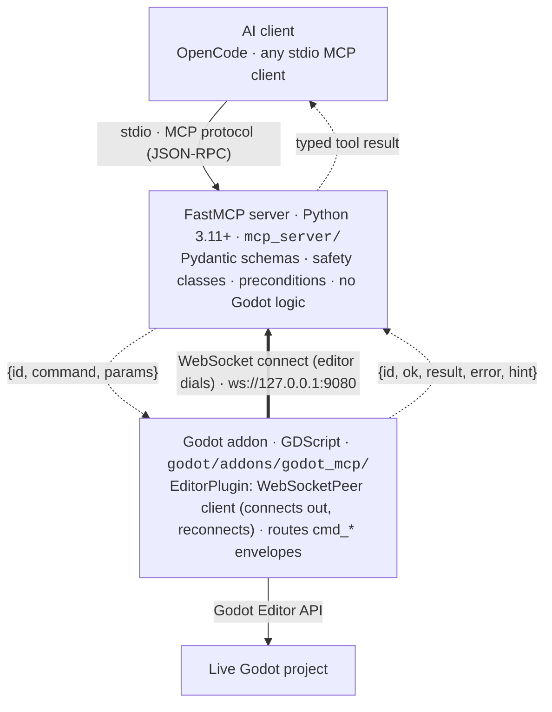
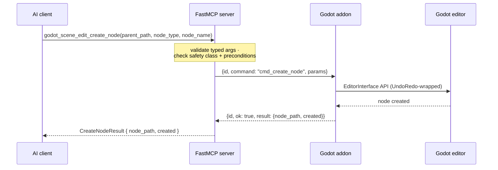

<p align="center">
  
</p>

<h1 align="center">godot-mcp</h1>

<p align="center">
  A <strong>generic, game-agnostic</strong> <a href="https://modelcontextprotocol.io">Model Context Protocol</a> (MCP) server for <strong>AI-driven Godot development</strong>.
</p>

<p align="center">
  <a href="https://pypi.org/project/godot-editor-mcp/"></a>
  <a href="https://github.com/hybridindie/godot-mcp/pkgs/container/godot-mcp"></a>
  <a href="https://github.com/hybridindie/godot-mcp/releases"></a>
  <a href="LICENSE"></a>
</p>

> **Status:** feature-complete across the planned ecosystem. **180 tools** across **29 categories** — always-on `core` plus 28 toggleable toolsets, of which only `inspection` is enabled by default (the other 27 are gated off). Every capability is documented, tested, and ready for agent use.
>
> **Package:** `godot-editor-mcp` on [PyPI](https://pypi.org/project/godot-editor-mcp/) · **Docker:** `ghcr.io/hybridindie/godot-mcp` · **Version:** `2026.08.26b1` (beta)

---

## Table of Contents

- [What is this?](#what-is-this)
- [Prerequisites](#prerequisites)
- [Quick Start](#quick-start)
- [Setup Guide](#setup-guide)
  - [Python / MCP Server](#python--mcp-server)
  - [Godot / Addon](#godot--addon)
  - [MCP Client Configuration](#mcp-client-configuration)
- [Using godot-mcp](#using-godot-mcp)
  - [Toolsets and the Gated Surface](#toolsets-and-the-gated-surface)
  - [Safety Classes](#safety-classes)
  - [Version Gating](#version-gating)
  - [Workflow Patterns](#workflow-patterns)
  - [Prompts & Skills](#prompts--skills)
  - [Error Handling](#error-handling)
- [Live Runtime & The Probe Autoload](#live-runtime--the-probe-autoload)
- [All Toolsets](#all-toolsets)
- [Configuration Reference](#configuration-reference)
- [Troubleshooting](#troubleshooting)
- [Architecture](#architecture)
- [Repository Layout](#repository-layout)
- [Contributing](#contributing)
- [License](#license)

---

## What is this?

godot-mcp bridges an AI agent and a live Godot editor. Instead of editing files blindly on disk, the agent drives the editor directly:

- **Inspect** the scene tree, selected nodes, and project settings live
- **Mutate** scenes — create nodes, attach scripts, connect signals — with undo support
- **Edit** GDScript files and check them for parse errors
- **Run** the game headless or control an editor play session
- **Drive** input, record replays, take screenshots, and profile performance
- **Export** builds, analyze code statically, and refactor across scenes

The server is **game-agnostic** — it knows Godot, not your game. A tower-defense roguelite, a 3D platformer, and a visual novel all use the same generic tools. Game-specific vocabulary ("spawn wave", "upgrade tower") belongs in a separate project that consumes this server.

---


## Prerequisites

| Component | Minimum | Recommended |
|-----------|---------|-------------|
| **Godot** | 4.4 | 4.7 (validated target) |
| **Python** | 3.11 | 3.13 |
| **Package manager** | [uv](https://docs.astral.sh/uv/) | uv |
| **OS** | macOS / Linux / Windows | Any desktop |

> **Godot 4.4 is the minimum.** The addon checks the editor version on enable and warns if it is older. Some toolsets (`scene_edit`, `input_map`, `tilemap`, `scene_3d`) are version-gated and refuse to enable on older editors.

---

## Quick Start

### Option A: Install from PyPI

```bash
pip install godot-editor-mcp --pre
godot-editor-mcp  # starts the MCP server (stdio mode)
```

### Option B: Run with Docker

```bash
docker pull ghcr.io/hybridindie/godot-mcp:latest
docker run -d -p 9090:9090 -p 9080:9080 \
  -e GODOT_MCP_AUTH_TOKEN=your-token \
  ghcr.io/hybridindie/godot-mcp:latest
```

The server listens on `http://localhost:9090` (MCP HTTP) and `ws://localhost:9080` (bridge).

### Option C: From source (development)

```bash
cd godot-mcp
uv sync
uv run godot-editor-mcp --help
```

### Install the Godot addon

**Option A: Download from GitHub releases** (no clone needed)

```bash
# Download the addon zip from the latest release
curl -L -o godot_mcp_addon.zip \
  https://github.com/hybridindie/godot-mcp/releases/latest/download/godot_mcp_addon.zip

# Extract into your Godot project (it contains addons/godot_mcp/)
unzip godot_mcp_addon.zip -d /path/to/your/project/
```

**Option B: From the Godot Asset Library**

Open Godot → **Editor → Manage Editor Features → Asset Library** → search for "Godot MCP" → **Install**.

**Option C: Copy from a source clone**

```bash
cp -r godot/addons/godot_mcp /path/to/your/project/addons/
```

After installing via any method, enable it: **Project → Project Settings → Plugins → Godot MCP → Enable**.

A status panel appears at the bottom of the editor (alongside Output and Debug). It shows connection state (color dot), server/Godot version, bridge URL, active scene, selected node, enabled toolsets, and a recent-command log with timing stats. The addon connects out to the MCP server's bridge listener (`ws://127.0.0.1:9080` by default) and reconnects automatically — so editor and server can start in either order.

### 3. Configure your MCP client

**OpenCode** (`opencode.json` in project root or `~/.config/opencode/opencode.json`):

```json
{
  "mcp": {
    "godot": {
      "type": "local",
      "command": ["uv", "run", "godot-editor-mcp"]
    }
  }
}
```

> The command runs from the repo root (so `uv` resolves this project's environment). Use absolute paths or `--directory` if launching elsewhere.

### 4. Start working

1. Open your Godot project and enable the addon.
2. Start your MCP client (OpenCode, etc.).
3. Ask the agent to inspect the project:
   - *"Show me the scene tree"* → `godot_inspection_get_scene_tree`
   - *"What node is selected?"* → `godot_inspection_get_selected_node`
   - *"List available toolsets"* → `godot_list_toolsets`
4. Enable a toolset when needed:
   - *"Enable scene editing"* → `enable_toolset("scene_edit")`
   - *"Create a player node"* → `godot_scene_edit_create_node`

---

## Setup Guide

### Python / MCP Server

```bash
# Full install with dev dependencies
uv sync

# Run tests
uv run pytest                    # full suite (~304 tests)
uv run pytest tests/contract     # contract tests (fake bridge)
uv run pytest tests/unit         # unit tests (isolated logic)

# Lint and type check
uv run ruff check .
uv run mypy

# Run the server manually
uv run godot-editor-mcp                 # stdio mode (default)
GODOT_MCP_TRANSPORT=http uv run godot-editor-mcp   # HTTP mode on 127.0.0.1:9090
```

<details>
<summary>pip + venv fallback (no uv)</summary>

```bash
python3 -m venv .venv
source .venv/bin/activate  # Windows: .venv\Scripts\activate
pip install -e '.[dev]'
pytest
```
</details>

### Godot / Addon

The addon lives at `godot/addons/godot_mcp/`. You have two options:

**Option A: Use the bundled project**
Open the `godot/` folder as a project in Godot 4.4+. Enable the plugin. This is a minimal project that exists only so the addon is loadable and testable.

**Option B: Copy into your own project**
```bash
cp -r godot/addons/godot_mcp /path/to/your/game/addons/
```
Then enable the plugin in Project Settings.

**What the addon provides:**
- **Status dock** — read-only panel showing bridge state, project info, active scene, selected node, and recent commands
- **WebSocket bridge** — a client that connects out to the MCP server's listener at `ws://127.0.0.1:9080` (configurable) and reconnects with backoff
- **Command router** — handles 80+ `cmd_*` commands that call the Godot Editor API
- **Debugger plugin** — captures the `godot_mcp:` debugger channel for live game inspection
- **Runtime probe** — `mcp_runtime_probe.gd`, an autoload you add to your game for live input/profiling

### MCP Client Configuration

The server exposes two transports:

| Transport | Use case | How to connect |
|-----------|----------|----------------|
| `stdio` | A single local agent (OpenCode) | `uv run godot-editor-mcp` |
| `http` | Shared service; remote or web-based clients | `scripts/serve-http.sh` |

`stdio` is the default and what most AI coding assistants expect: the client
spawns its own server subprocess and they speak JSON-RPC over stdin/stdout.

**Service mode (one server, many clients).** The bridge to the editor is a
single connection — only one server process can own it at a time. So when you
want **several** clients on the same live editor (e.g. OpenCode *and* the
[godot-agents](https://github.com/hybridindie/godot-agents) project), run **one**
HTTP service and have every client connect to it instead of each spawning its own:

```bash
scripts/serve-http.sh            # http://127.0.0.1:9090/mcp  + editor bridge :9080
```

Clients then point at `http://127.0.0.1:9090/mcp` (FastMCP's Streamable HTTP
mount). OpenCode, via `opencode.json`:

```json
{ "mcpServers": { "godot": { "type": "http", "url": "http://127.0.0.1:9090/mcp" } } }
```

For non-loopback binds (e.g. Docker's `0.0.0.0`), set `GODOT_MCP_AUTH_TOKEN` to a
bearer token. This prevents unauthorized access — when the server binds an
interface reachable from other machines, anyone on the network could send MCP
commands to the Godot editor without it. The server refuses to start on a
non-loopback bind without a token ([#226](https://github.com/hybridindie/godot-mcp/issues/226)).
Generate any random string and set it as the token; clients pass it as `auth`:

```bash
# Generate a token
TOKEN=$(openssl rand -hex 32)
```

```json
{ "mcpServers": { "godot": { "type": "http", "url": "http://0.0.0.0:9090/mcp", "auth": "<token>" } } }
```

> **Local stdio mode** (the default `pip install` path) does not need a token —
> it only applies to HTTP transport on non-loopback binds.

**Docker client setup.** When running the server in Docker, the server binds
`0.0.0.0` inside the container, so a token is required. Set it on the server,
then pass the same token to the client:

```bash
# Server: set the token
TOKEN=$(openssl rand -hex 32)
docker run -d -p 9090:9090 -p 9080:9080 \
  -e GODOT_MCP_AUTH_TOKEN=$TOKEN \
  ghcr.io/hybridindie/godot-mcp:latest

# Client (OpenCode opencode.json):
# { "mcpServers": { "godot": { "type": "http", "url": "http://127.0.0.1:9090/mcp", "auth": "<TOKEN>" } } }
```

The Godot editor addon also needs to know where to connect. Set
`GODOT_MCP_BRIDGE_URL` in the editor's environment or project settings to point
at the host's bridge port (default `ws://127.0.0.1:9080`):

---

## Using godot-mcp

### Toolsets and the Gated Surface

With 180 tools, showing everything at once would overwhelm an agent's context window and degrade tool selection. So tools are **grouped into toolsets** and most are **gated off by default**.

**Always exposed:**
- `core` — diagnostics, toolset management, safety introspection
- `inspection` — read-only project/scene/node inspection

**Gated off by default** (27 toolsets):
`scene_edit`, `scripts`, `resources_edit`, `project`, `editor`, `physics`, `animation`, `scene_3d`, `particles`, `navigation`, `audio`, `tilemap`, `theme_ui`, `shader`, `visual_shader`, `runtime`, `input`, `input_map`, `testing`, `profiling`, `batch`, `analysis`, `export`, `debugger`, `asset_import`, `project_scaffold`, `composite`

**Meta-tools** (always available in `core`):

| Tool | Purpose |
|------|---------|
| `godot_get_server_info` | Full capability snapshot: toolsets, prompts, resources, bridge state, troubleshooting |
| `godot_list_toolsets` | Discover toolsets, their enabled state, and version requirements |
| `godot_enable_toolset(category)` | Expose a toolset's tools (fires `tools/list_changed`) |
| `godot_disable_toolset(category)` | Hide a toolset to keep the surface small |
| `godot_list_tools_by_safety_class` | Report which tools are `read_only` / `mutating` / `destructive` / `runtime` |

Enable a toolset before using its tools:

```
Agent: godot_enable_toolset("scene_edit")
Server: { "name": "scene_edit", "enabled": true, "description": "...", "min_godot": "4.4" }

Agent: godot_scene_edit_create_node(parent_path=".", node_type="CharacterBody2D", node_name="Player")
Server: { "node_path": "./Player", "created": true }
```

### Safety Classes

Every tool carries a safety class that determines its risk and required parameters:

| Class | Risk | Extra params | Example |
|-------|------|------------|---------|
| `read_only` | None | none | `godot_inspection_get_scene_tree`, `godot_scripts_read` |
| `mutating` | Reversible change | `dry_run: bool = False` | `godot_scene_edit_create_node`, `godot_scene_edit_set_node_property` |
| `destructive` | May be irreversible | `dry_run` **and** `confirm: bool = True` | `godot_scene_edit_delete_node`, `godot_scene_edit_reload_scene` |
| `runtime` | Controls execution | varies | `godot_runtime_play_scene`, `godot_runtime_run_and_capture`, `godot_export_project` |

- `dry_run=True` runs preconditions and returns what *would* happen without sending any change.
- `confirm=True` is required for destructive tools. Without it, the tool returns `PRECONDITION_FAILED: ... [required=confirm]`.

All safety logic lives in `mcp_server/safety.py` — **never** in the addon.

### Transport Security

The server has two layers of security:

**1. Tool-level safety classes** (above) — gate individual operations with `dry_run`/`confirm` preconditions. These apply in every transport mode.

**2. Transport-level auth** — gates *who can connect* to the server at all:

| Mode | Bind address | Auth required | Why |
|------|-------------|---------------|-----|
| `stdio` (default) | N/A (local subprocess) | No | Only the spawning client can talk to it |
| `http` on loopback | `127.0.0.1` | No | Only local processes can reach it |
| `http` on non-loopback | `0.0.0.0` / external IP | **Yes** — `GODOT_MCP_AUTH_TOKEN` | Network-accessible; without a token, anyone could write scripts, run the game, or export builds through the editor |

The server **refuses to start** on a non-loopback HTTP bind without `GODOT_MCP_AUTH_TOKEN` set (issue [#226](https://github.com/hybridindie/godot-mcp/issues/226)). This is a fail-fast guard — the error message tells you to set the token or bind loopback.

The token is a bearer token: any random string you choose. The server validates it via `StaticTokenVerifier`; clients pass it as `auth` in their MCP config. Docker deployments always bind `0.0.0.0` inside the container, so the token is required there.

```bash
# Server: set the token
docker run -e GODOT_MCP_AUTH_TOKEN=$(openssl rand -hex 32) ...

# Client: pass the same token
# { "mcpServers": { "godot": { "type": "http", "url": "http://...", "auth": "<token>" } } }
```

> **Why this matters:** the MCP server can write files, run arbitrary GDScript, execute the Godot binary, and export projects. An unauthenticated network endpoint would let anyone on the LAN do all of that through your editor. The token gate ensures only clients you trust can connect.

### Version Gating

Some toolsets depend on Godot editor APIs that are only reliable from 4.4 onward:

| Toolset | Min Godot | Why gated |
|---------|-----------|-----------|
| `scene_edit` | 4.4 | Scene session and PackedScene APIs validated on 4.4+ |
| `input_map` | 4.4 | `ProjectSettings.save()` for input actions stable from 4.4+ |
| `tilemap` | 4.4 | TileSet/AtlasSource APIs changed significantly |
| `scene_3d` | 4.4 | MeshLibrary authoring uses ResourceSaver; validated on 4.4+ |

When the agent calls `enable_toolset("input_map")` on a 4.3 editor:

```
PRECONDITION_FAILED: Toolset 'input_map' requires Godot 4.4+ (connected editor is 4.3).
Upgrade the editor or enable a different toolset. [required=godot_version]
```

If the bridge is disconnected:

```
BRIDGE_DISCONNECTED: Toolset 'input_map' requires Godot 4.4+, but the Godot bridge
is not connected. Start the editor with the addon enabled and retry. [required=bridge_connected]
```

If the version query fails:

```
PRECONDITION_FAILED: Toolset 'input_map' requires Godot 4.4+, but the Godot version
could not be determined. Check the editor and addon status, then retry. [required=bridge_connected]
```

### Workflow Patterns

A typical agent session follows this pattern:

**1. Discovery**
```
get_server_info          → capability snapshot: toolsets, bridge state, docs URLs
list_toolsets            → see what's available
get_project_info         → project name, Godot version, main scene, autoloads
get_active_scene         → is a scene open? which one?
get_scene_tree           → inspect the node hierarchy
get_selected_node        → what the user is currently working on
```

**2. Planning**
```
list_tools_by_safety_class   → know which tools are read-only vs. mutating
enable_toolset("scene_edit") → expose scene mutation tools
dry_run preview              → preview changes before committing
```

**3. Action (scene editing)**
```
create_node → rename_node → set_node_property → attach_script
save_scene
```

**4. Verification**
```
debug_workflow(scene="res://main.tscn", timeout_seconds=10)
→ returns parse errors, scene tree, run results, findings, and suggestions in one call

run_and_capture(scene="res://main.tscn", timeout_seconds=10)
→ returns exit code, errors, warnings, output
```

**5. Live testing (with probe)**
```
enable_toolset("runtime")
play_scene()
get_game_scene_tree()
simulate_action("jump", pressed=true)
assert_node_state("Player", "position.y", expected=0, op="==")
stop_scene()
```

**6. Export**
```
enable_toolset("export")
list_export_presets()
export_project(preset="Web", output_path="builds/web")
```

### Prompts & Skills

Beyond the tool surface, two layers help an agent drive the server well:

- **MCP prompts** — step-numbered workflow recipes the server exposes over MCP. Clients that surface prompts (etc.) show them as slash commands, e.g. `/mcp__godot-mcp__build_scene`. Shipped: `toolset_discovery`, `build_scene`, `play_test`, `script_edit`, `debug_scene`, `troubleshoot`, `author_resource`, `export_build`, `batch_refactor`. Discover with `list_prompts()`; render with `render_prompt(name, arguments={...})`.
- **AI skills** ([`skills/`](skills/README.md)) — optional, client-agnostic. Unlike prompts, a skill *auto-triggers* when the agent recognizes a matching task (no slash command), then routes to the prompts and tools. Install with `./scripts/install-skills.sh` (opencode, Claude, or custom target). Shipped: `godot-getting-started`, `godot-playtest-and-debug`, `godot-expert` (engine knowledge + 7 reference guides).

Both stay pure to the generic Godot surface — no game-specific vocabulary.

### Error Handling

All errors are **structured** — never Python tracebacks. The agent can parse them and recover:

```json
{ "ok": false, "error": "PRECONDITION_FAILED", "hint": "No scene is open.", "required": "active_scene" }
```

| Error code | Meaning | How to recover |
|------------|---------|--------------|
| `PRECONDITION_FAILED` | A required condition isn't met | Check `required` field and satisfy it |
| `RESOURCE_NOT_FOUND` | Node/scene/resource doesn't exist | Verify the path or create it first |
| `VALIDATION_ERROR` | Bad parameters | Check the schema and retry |
| `BRIDGE_DISCONNECTED` | Addon not reachable | Ensure Godot is running with the addon enabled |
| `TIMEOUT` | No response in time | Retry; check if Godot is frozen |
| `INTERNAL_ERROR` | Unexpected failure | Report as a bug |

When using MCP tools, errors surface as `ToolError` with the message in `"<ERROR_CODE>: <hint> [required=<field>]"` format.

---

## Live Runtime & The Probe Autoload

Some tools inspect or drive a **running** game (not the editor). This requires the game to be launched **from the editor** so it connects to the editor's debugger. The addon captures the debugger channel, but it needs cooperation from the game side.

### Setting up the probe

1. In your game's project, add `res://addons/godot_mcp/mcp_runtime_probe.gd` as an **autoload**:
   - **Project → Project Settings → Globals/Autoload**
   - Path: `res://addons/godot_mcp/mcp_runtime_probe.gd`
   - Name: any (e.g., `MCPRuntimeProbe`)
2. The probe no-ops outside a debug session, so it's safe to leave enabled.

### What works with/without the probe

| Capability | Needs probe? | Without probe |
|------------|-------------|---------------|
| `godot_runtime_play_scene` / `godot_runtime_stop_scene` | No | Works (editor play control) |
| `godot_runtime_get_game_scene_tree` | Yes | Returns `connected: false` + hint |
| `godot_input_simulate_key` / `godot_input_simulate_mouse` / `godot_input_simulate_action` | Yes | `PRECONDITION_FAILED: required=runtime_probe` |
| `godot_runtime_monitor_property` / `godot_runtime_get_property_samples` | Yes | `PRECONDITION_FAILED: required=runtime_probe` |
| `godot_runtime_find_ui_elements` | Yes | `PRECONDITION_FAILED: required=runtime_probe` |
| `godot_profiling_get_performance_monitors` (live game) | Yes | Returns `connected: false` + hint |
| `godot_input_record` / `godot_input_stop_recording` | Yes | `PRECONDITION_FAILED: required=runtime_probe` |
| `godot_runtime_run_and_capture` | No | Runs Godot headless subprocess directly |
| `godot_export_project` | No | Runs Godot headless subprocess directly |

---

## All Toolsets

The full surface is 180 tools across 29 categories (`core` + 28 toggleable toolsets). Below is a summary; the authoritative per-tool spec is in [`docs/tool-contracts.md`](docs/tool-contracts.md).

### Core (always on)
- `godot_health_check` — server version + bridge state
- `godot_get_server_info` — full capability snapshot: toolsets, prompts, resources, bridge state, and common troubleshooting scenarios (call this first)
- `godot_debug_workflow` — one-call comprehensive debug check: parse errors, scene tree, headless run, and bridge state
- `godot_list_toolsets` / `godot_enable_toolset` / `godot_disable_toolset` — toolset management
- `godot_list_tools_by_safety_class` — safety introspection
- `godot_read_resource` — fallback for clients without resource protocol support

### Inspection (always on) — `read_only`
- `godot_inspection_get_project_info` — name, Godot version, main scene, autoloads, input actions
- `godot_inspection_get_active_scene` — is_open, path, name
- `godot_inspection_get_scene_tree` — full node hierarchy with `max_depth` control
- `godot_inspection_get_selected_node` — the currently selected node in the editor
- `godot_inspection_get_node_properties` — type, script, properties, children for any node path
- `godot_inspection_get_node_property` — read a single property by name, including built-in Godot properties
- `godot_inspection_get_node_groups` — a node's group memberships (for snapshot/rollback)

### Scene Edit (gated) — `mutating` / `destructive`
- **Node creation:** `godot_scene_edit_create_node`, `godot_scene_edit_instance_scene`, `godot_scene_edit_duplicate_node`
- **Hierarchy:** `godot_scene_edit_move_node`, `godot_scene_edit_rename_node`, `godot_scene_edit_delete_node` (destructive, needs `confirm`)
- **Properties:** `godot_scene_edit_set_node_property` (with Godot↔JSON type coercion)
- **Scripts:** `godot_scene_edit_attach_script`
- **Signals:** `godot_scene_edit_connect_signal`, `godot_scene_edit_disconnect_signal`, `godot_scene_edit_list_signal_connections`
- **Groups:** `godot_scene_edit_add_to_group`, `godot_scene_edit_remove_from_group`
- **Scene I/O:** `godot_scene_edit_save_scene`, `godot_scene_edit_create_scene`, `godot_scene_edit_close_scene` (destructive, needs `confirm`)
- **Session:** `godot_scene_edit_open_scene`, `godot_scene_edit_reload_scene` (destructive), `godot_scene_edit_save_all_scenes`, `godot_scene_edit_list_open_scenes`, `godot_scene_edit_select_nodes`

### Scripts (gated) — `read_only` / `mutating`
- `godot_scripts_read`, `godot_scripts_list`, `godot_scripts_get_for_node`
- `godot_scripts_write`, `godot_scripts_patch` (both `mutating`, support `dry_run`)
- `godot_scripts_get_parse_errors` — shells out to `godot --check-only`

### Resources & Autoloads (gated) — `read_only` / `mutating`
- `godot_resources_edit_read_resource_file`, `godot_resources_edit_create_resource`, `godot_resources_edit_set_resource_property`
- `godot_resources_edit_register_autoload`, `godot_resources_edit_unregister_autoload`

### Project & Filesystem (gated) — `read_only` / `mutating`
- `godot_project_get_filesystem_tree` — recursive project tree
- `godot_project_search_files` — by name glob and/or content substring
- `godot_project_get_setting`, `godot_project_set_setting` — project settings
- `godot_project_resolve_uid` — path ↔ uid:// resolution
- `godot_project_delete_resource_file` — delete a `res://` file (destructive; inverse of file-creating tools)

### Editor (gated) — `read_only`
- `godot_editor_capture_screenshot` — returns a PNG image for vision-capable clients

### Physics (gated) — `mutating`
- `godot_physics_setup_body`, `godot_physics_setup_collision`, `godot_physics_set_layers`, `godot_physics_add_raycast`

### Animation (gated) — `mutating` / `read_only`
- `godot_animation_create`, `godot_animation_add_track`, `godot_animation_insert_keyframe`
- `godot_animation_create_tree`, `godot_animation_add_state_machine_state`, `godot_animation_set_blend_tree_node`
- `godot_animation_list_animations`, `godot_animation_get` — read tracks/keyframes (for snapshot/rollback)

### 3D Scene (gated) — `mutating`
- `godot_scene_3d_add_mesh_instance`, `godot_scene_3d_setup_camera`, `godot_scene_3d_setup_lighting`, `godot_scene_3d_setup_environment`, `godot_scene_3d_gridmap_set_cell`, `godot_scene_3d_gridmap_get_cell`
- **MeshLibrary authoring:** `godot_scene_3d_create_mesh_library`, `godot_scene_3d_add_mesh_library_item`

### Particles (gated) — `mutating` / `read_only`
- `godot_particles_create`, `godot_particles_set_material`, `godot_particles_set_color_gradient`, `godot_particles_apply_preset`, `godot_particles_get_material`

### Navigation (gated) — `mutating`
- `godot_navigation_setup_region`, `godot_navigation_setup_agent`, `godot_navigation_bake_mesh`, `godot_navigation_set_layers`

### Audio (gated) — `read_only` / `mutating` / `destructive`
- `godot_audio_add_player`, `godot_audio_get_bus_layout`, `godot_audio_add_bus`, `godot_audio_add_bus_effect`, `godot_audio_remove_bus` (destructive), `godot_audio_remove_bus_effect` (destructive)

### TileMap (gated) — `read_only` / `mutating`
- `godot_tilemap_set_cell`, `godot_tilemap_fill_rect`, `godot_tilemap_get_cell`, `godot_tilemap_get_used_cells`, `godot_tilemap_clear`, `godot_tilemap_layers`
- **TileSet authoring:** `godot_tilemap_create_tileset`, `godot_tilemap_add_tileset_atlas_source`, `godot_tilemap_create_tile`

### Theme & UI (gated) — `mutating` / `read_only`
- `godot_theme_ui_create`, `godot_theme_ui_set_color`, `godot_theme_ui_set_font_size`, `godot_theme_ui_set_stylebox`, `godot_theme_ui_get_node_overrides`

### Shaders (gated) — `read_only` / `mutating`
- `godot_shader_create`, `godot_shader_read`, `godot_shader_assign_material`, `godot_shader_set_param`

### Runtime (gated) — `runtime` / `read_only`
- `godot_runtime_run_and_capture` — headless subprocess
- `godot_runtime_play_scene`, `godot_runtime_stop_scene`, `godot_runtime_is_playing`, `godot_runtime_get_game_scene_tree` — editor play session

### Input Simulation (gated) — `runtime` / `read_only`
- `godot_input_simulate_key`, `godot_input_simulate_mouse`, `godot_input_simulate_action`, `godot_input_play_sequence`
- `godot_input_get_stats`, `godot_input_record`, `godot_input_stop_recording`

### Testing / QA (gated) — `runtime` / `read_only`
- `godot_testing_run_tests` — run the project's GDScript test suite (GUT) headlessly and return structured pass/fail results
- `godot_testing_assert_node_state` — assert a live node property against an expected value
- `godot_testing_run_test_scenario` — play a scene, run an input sequence, evaluate assertions
- `godot_testing_run_stress_test` — fuzz the running game with random input
- `godot_testing_compare_screenshots` — per-pixel diff of two base64 PNGs

> **GUT dependency:** `godot_testing_run_tests` requires [GUT](https://github.com/bitwes/Gut) (Godot Unit Test) installed in the project at `addons/gut/`. If GUT is not installed, the tool returns `framework_absent=true` (a normal outcome, not an error) so the agent can fall back to `godot_scripts_get_parse_errors` or `godot_runtime_run_and_capture` for a smoke check. GUT 9.3–9.7+ output is supported.

### Profiling (gated) — `read_only`
- `godot_profiling_get_editor_performance` — editor process monitors
- `godot_profiling_get_performance_monitors` — live game monitors (via probe)

### Batch / Refactor (gated) — `read_only` / `mutating`
- `godot_batch_find_nodes_by_type`, `godot_batch_set_property`, `godot_batch_cross_scene_set_property`, `godot_batch_get_dependencies`

### Static Analysis (gated) — `read_only`
- `godot_analysis_find_unused_resources`, `godot_analysis_analyze_signal_flow`, `godot_analysis_detect_circular_dependencies`, `godot_analysis_project_stats`, `godot_analysis_project_structure`

### Export (gated) — `read_only` / `runtime`
- `godot_export_list_presets`, `godot_export_get_info`, `godot_export_project`

### Input Map (gated, Godot 4.4+) — `mutating` / `destructive` / `read_only`
- `godot_input_map_add_action`, `godot_input_map_remove_action` (destructive), `godot_input_map_add_event`, `godot_input_map_clear_action_events` (destructive), `godot_input_map_get_action_events` (read_only)

### Visual Shaders (gated) — `read_only` / `mutating`
- `godot_visual_shader_create`, `godot_visual_shader_add_node`, `godot_visual_shader_connect_nodes`, `godot_visual_shader_set_node_param`
- `godot_visual_shader_list_node_types`, `godot_visual_shader_read` — node-graph introspection

### Debugger (gated) — `runtime`
- **Breakpoints:** `godot_debugger_set_breakpoint`, `godot_debugger_remove_breakpoint`, `godot_debugger_clear_breakpoints`
- **Execution:** `godot_debugger_force_break`, `godot_debugger_continue_execution`, `godot_debugger_step_into`, `godot_debugger_step_over`, `godot_debugger_step_out`
- **Inspect paused state:** `godot_debugger_get_stack_frames`, `godot_debugger_get_frame_variables`, `godot_debugger_evaluate_expression`

### Asset Import (gated) — `read_only` / `mutating`
- `godot_asset_import_asset`, `godot_asset_import_get_status` — import external assets and poll status
- `godot_asset_import_create_material_from_textures` — build a `StandardMaterial3D` from texture maps

### Project Scaffold (gated) — `destructive`
- `godot_project_scaffold` — generate a new project skeleton (directories, `project.godot`, starter scenes); destructive, needs `confirm`

### Composite / Macro (gated) — `mutating`
- `godot_composite_compose_node`, `godot_composite_batch_create_nodes`, `godot_composite_apply_node_edits`, `godot_composite_run_commands` — one-call macros that fold several mutations into a single undo-tracked operation

### Resources (`godot://` URIs)
Read-only snapshots refreshed on access:
- `godot://project/info` — project info
- `godot://scene/current` — active scene
- `godot://scene/tree` — full scene tree
- `godot://scene/tree/{max_depth}` — tree limited to N levels
- `godot://node/selected` — selected node snapshot

---

## Configuration Reference

All configuration is optional and passed via environment variables:

| Variable | Default | Description |
|----------|---------|-------------|
| `GODOT_MCP_TRANSPORT` | `stdio` | `stdio` or `http` |
| `GODOT_MCP_HTTP_HOST` | `127.0.0.1` | HTTP bind host |
| `GODOT_MCP_HTTP_PORT` | `9090` | HTTP bind port |
| `GODOT_MCP_BRIDGE_URL` | `ws://127.0.0.1:9080` | Bridge endpoint — the server **binds** it (listener) and the addon **connects** to it; set the same value on both sides |
| `GODOT_MCP_GODOT_BIN` | auto-discovered | Godot executable for `godot_runtime_run_and_capture` / `godot_export_project` |
| `GODOT_MCP_PROJECT_DIR` | connected editor's project | Project directory for runner, export, and analysis |
| `GODOT_MCP_LOG_LEVEL` | `INFO` | Log level (`DEBUG`, `INFO`, `WARNING`, `ERROR`) — JSON to stderr |
| `GODOT_MCP_APPROVAL_WEBHOOK` | unset | Optional human-in-the-loop approval webhook for destructive tools (`ApprovalMiddleware`) |
| `GODOT_MCP_AUTH_TOKEN` | unset | Bearer token for HTTP transport auth; **required** for non-loopback binds |

---

## Troubleshooting

### "Godot bridge is not connected"
- Ensure Godot is running with the **godot_mcp addon enabled** (status dock visible). The addon connects out to the server and reconnects automatically, so start order doesn't matter — give it a moment after either side starts.
- Check that nothing else is using port `9080` (the **server** binds it; the addon dials in).
- Check the Godot Output panel for WebSocket errors, and confirm both sides agree on `GODOT_MCP_BRIDGE_URL` if you changed it.

### "Toolset requires Godot 4.4+"
- Upgrade to Godot 4.4 or newer. The addon checks version on enable.

### "PRECONDITION_FAILED: required=active_scene"
- Open a `.tscn` scene in the Godot editor before calling scene editing tools.

### "PRECONDITION_FAILED: required=confirm"
- Destructive tools (`godot_scene_edit_delete_node`, `godot_scene_edit_reload_scene`, etc.) need `confirm=True`.
- Or use `dry_run=True` to preview.

### "PRECONDITION_FAILED: required=play_session"
- Call `play_scene()` before using live runtime/input/profiling tools.

### "PRECONDITION_FAILED: required=runtime_probe"
- Add `addons/godot_mcp/mcp_runtime_probe.gd` as an autoload in your game project.

### "Godot binary not found"
- Set `GODOT_MCP_GODOT_BIN` to the full path, or ensure `godot` is in your `PATH`.

### Screenshot capture fails
- The editor must have a display (not `--headless`). The addon captures the viewport.

### Export fails
- Ensure export templates are installed for the target platform in Godot.

---

## Architecture

Every agent action crosses a four-layer chain:



The **editor dials** the connection (bold arrow) and reconnects on its own; the **server still drives every command** (dashed `{id, command, …}`). Those two directions are decoupled — the bridge inversion (#276) only changed who connects.

A single tool call — `godot_scene_edit_create_node` — travels the full chain and back:



> Solid arrows are the request path (top-down); dashed arrows are the response envelope flowing back up.

The boundary is deliberate and enforced by design rules:
- **Only the addon touches Godot.** The server has no Godot imports.
- **Only the server owns safety.** All `dry_run`, `confirm`, and precondition logic lives in Python.
- **JSON envelopes everywhere.** Commands and responses carry `{id, ok, result, error, hint}` — structured, versioned, and never a Python traceback.

Read [`docs/architecture.md`](docs/architecture.md) for the full bridge contract, envelope spec, and type coercion rules.

---
## Repository Layout

```
godot-mcp/
├── AGENTS.md               # Single entry point for AI agents
├── CONTRIBUTING.md         # Contributor guide
├── README.md               # This file
├── LICENSE                 # MIT
├── pyproject.toml          # Package config (godot-editor-mcp)

├── .env.example            # End-user env template
├── .env.dev.example        # Developer env template (graphify + opencode)
│
├── .github/workflows/      # CI, e2e, eval, publish
├── .opencode/              # opencode config + constitutional rules
├── .pr_agent.toml          # PR reviewer config
│
├── mcp_server/             # FastMCP server (Python 3.11+)
│   ├── main.py             # stdio / HTTP entrypoint
│   ├── server.py           # server factory + tool registrations
│   ├── bridge.py           # async WebSocket listener
│   ├── safety.py           # safety classes, preconditions, dry_run/confirm
│   ├── tools/              # @mcp.tool() handlers (thin delegation)
│   ├── resources/          # godot:// read-only resource handlers
│   ├── models/             # Pydantic typed I/O models
│   └── prompts/            # @mcp.prompt() workflow recipes
│
├── godot/                  # Godot addon source
│   ├── addons/godot_mcp/   # EditorPlugin, bridge, dock, cmd_* handlers
│   └── tests/              # GDScript smoke tests
│
├── docs/                   # Architecture, tool-contracts, tutorial
├── skills/                 # 3 installable AI skills
├── examples/               # survivors + vampire example games
├── infra/                  # Docker + K8s deployment
├── scripts/                # install-skills, graphify, hooks
│   └── dev/                # One-off dev scripts
├── tests/                  # Python test suite (contract + integration + unit)
└── evals/                  # Instruction-staleness self-analysis (harness lives in godot-agents)
```

---

## Contributing

See [`CONTRIBUTING.md`](CONTRIBUTING.md) for setup, workflow, conventions, and rules.

---

## License

[MIT](LICENSE) — see the `LICENSE` file for the full text.

---

## Resources

- [PyPI package](https://pypi.org/project/godot-editor-mcp/) — `pip install godot-editor-mcp --pre`
- [Docker image](https://github.com/hybridindie/godot-mcp/pkgs/container/godot-mcp) — `docker pull ghcr.io/hybridindie/godot-mcp:latest`
- [Model Context Protocol spec](https://modelcontextprotocol.io)
- [FastMCP docs](https://gofastmcp.com)
- [Godot 4.4 docs](https://docs.godotengine.org/en/4.4/)
- [Project issues](https://github.com/hybridindie/godot-mcp/issues)
- [GitHub releases](https://github.com/hybridindie/godot-mcp/releases)
- [`CONTRIBUTING.md`](CONTRIBUTING.md) — setup, workflow, conventions
- [`AGENTS.md`](AGENTS.md) — full project context for AI agents
- [`docs/tool-contracts.md`](docs/tool-contracts.md) — the authoritative per-tool reference
- [`docs/architecture.md`](docs/architecture.md) — the bridge and envelope contract
- [`docs/tutorial.md`](docs/tutorial.md) — LLM-prompt tutorial for building a game
- [`skills/README.md`](skills/README.md) — installable AI skills
- [`infra/README.md`](infra/README.md) — Docker and K8s deployment
