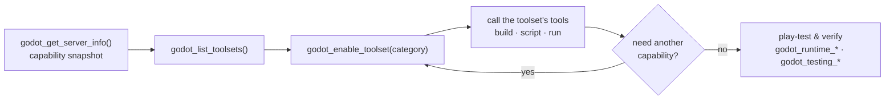

# Tutorial: Building and Testing a Game with godot-mcp (LLM-Prompt Edition)

This tutorial demonstrates how to use **godot-mcp** to build, edit, play-test, and verify a simple 2D game — all while Godot remains open. Unlike a reference manual, this document is written as **a series of natural-language prompts you can send to an LLM agent** (Claude Code, OpenCode, etc.). The agent will invoke MCP tools automatically to carry out each instruction.

> **Prerequisites**: Godot 4.4+ installed, `uv` (Python package manager), and the godot-mcp addon enabled in your project.

---

## How the LLM Knows About Toolset Gating

The server automatically teaches the LLM about toolset gating through **four mechanisms**:

### 1. Server Instructions (Automatic)

Every time the MCP client connects, the server sends initialization instructions that explain the gating system. The LLM sees this automatically — no setup required.

**What the LLM receives:**
> "You are connected to a godot-mcp server that gates its tools into categories called 'toolsets'. Only 'core' and 'inspection' are enabled by default. Every other capability is hidden until you explicitly enable it."
>
> "MANDATORY PROTOCOL: 1. Call godot_get_server_info() for a full capability snapshot. 2. Call godot_list_toolsets() to see what is available. 3. Call godot_enable_toolset(category) for every category you plan to use. 4. Only after enabling can you call the tools in that category."

### 2. MCP Prompts (Discoverable)

The server exposes **workflow prompts** that the LLM can discover and use:

| Prompt | When to Use |
|--------|------------|
| `toolset_discovery` | At the start of every session to learn the gating system |
| `build_scene` | When creating a new scene with nodes and scripts |
| `play_test` | When testing the game live inside the editor |
| `script_edit` | When writing, attaching, and iterating on GDScript |
| `debug_scene` | When something is broken and you want a systematic diagnosis |
| `troubleshoot` | When you see an error and need help interpreting it |
| `author_resource` | When authoring a TileSet, MeshLibrary, Theme, Shader, or custom `.tres` |
| `export_build` | When exporting a build for a target platform |
| `batch_refactor` | When changing one property across many nodes safely |

The LLM can discover these via `list_prompts()` and render them via `get_prompt(name)` or `render_prompt(name)`. Not all clients expose prompts to the user, but the ones that do (Claude Code, etc.) will surface them as templates.

> **Claude skills:** if you use Claude, the [`skills/`](skills/README.md) directory ships skills that auto-trigger on a matching task (no slash command needed) and route to these prompts and tools — copy them into `~/.claude/skills/` or your project's `.claude/skills/`. See [`skills/README.md`](skills/README.md).

### 3. Tool Docstrings

Every tool's description explicitly states which toolset it belongs to. For example, `godot_scene_edit_create_node`'s docstring says "Requires the `scene_edit` toolset. Call `godot_enable_toolset('scene_edit')` first." This means even if the LLM forgets the instructions, the tool description reminds it.

### 4. System Prompt Template (Manual Fallback)

If your MCP client does **not** surface server instructions or prompts (older versions, some configurations), paste this into your first message to teach the LLM:

```
You are working with a godot-mcp server. Tools are gated into categories called 'toolsets'. 
Only 'core' and 'inspection' are enabled by default. Before doing any scene editing, 
script writing, runtime testing, or batch operations, you MUST:

1. Call godot_get_server_info() for a full capability snapshot: toolsets, prompts, resources, bridge state, and troubleshooting.
2. Call godot_list_toolsets() to see what is available and which are enabled.
3. Call godot_enable_toolset(category) for every category you plan to use.
4. Only after enabling can you call the tools in that category.

Common toolsets:
- scene_edit  → godot_scene_edit_create_node, godot_scene_edit_set_node_property, godot_scene_edit_attach_script, godot_scene_edit_save_scene
- scripts     → godot_scripts_write, godot_scripts_read, godot_scripts_get_parse_errors  
- runtime     → godot_runtime_run_and_capture, godot_runtime_play_scene, godot_runtime_stop_scene
- input       → godot_input_simulate_action, godot_input_simulate_key, godot_input_play_sequence
- testing     → godot_testing_assert_node_state, godot_testing_run_test_scenario
- batch       → godot_batch_set_property, godot_batch_find_nodes_by_type
- physics     → godot_physics_setup_body, godot_physics_setup_collision
- resources_edit → godot_resources_edit_register_autoload, godot_resources_edit_create_resource

If you get 'ToolError: unknown tool', the toolset is not enabled. Call godot_enable_toolset first.
```

Every agent session follows the same gated-surface loop — discover, enable, then build and play-test:



---

## What We'll Build

A **Coin Collector** mini-game:
- A player (`CharacterBody2D`) moves with arrow keys
- Three gold coins (`Area2D`) are scattered on the map
- Collecting all coins shows a "You Win!" label

This exercises physics, collision detection, signals, groups, UI, input mapping, and the live runtime probe.

---

## Part 1: Manual Setup (One-Time)

### 1.1 Install the addon

Copy the addon into a fresh demo project:

```bash
mkdir -p godot/demo/addons
cp -r godot/addons/godot_mcp godot/demo/addons/
```

### 1.2 Enable the plugin

Open `godot/demo/` as a project in Godot, then:

**Project → Project Settings → Plugins → godot_mcp → Enable**

A status dock appears at the bottom showing:
- Bridge connection state (🔴 offline → 🟢 online)
- Project path
- Active scene name
- Selected node

### 1.3 Configure your MCP client

**OpenCode** (`opencode.json`):
```json
{
  "mcp": {
    "godot": {
      "type": "local",
      "command": ["uv", "run", "godot-mcp"]
    }
  }
}
```

**Claude Code** (`.mcp.json`):
```json
{
  "mcpServers": {
    "godot": {
      "command": "uv",
      "args": ["run", "godot-mcp"]
    }
  }
}
```

**Important**: Ensure the `GODOT_MCP_GODOT_BIN` env var points to your Godot executable, or that `godot` is on your `PATH`.

---

## Part 2: Prompt-by-Prompt Game Creation

For each prompt below, paste it into your MCP client chat. The LLM will use the appropriate godot-mcp tools automatically.

---

### Prompt 2.1: Discovery

> "Show me what toolsets are available, then get the current project info and the active scene."

**What the agent will do:**
- `godot_list_toolsets` → discover available categories
- `godot_inspection_get_project_info` → read project name, Godot version, main scene
- `godot_inspection_get_active_scene` → check if a scene is open

**Example response:**
> Project `godot-mcp-demo` on Godot 4.6.3. No scene is currently open.

---

### Prompt 2.2: Enable Scene Editing

> "Enable the scene_edit and scripts toolsets so I can build the game."

**What the agent will do:**
- `godot_enable_toolset("scene_edit")`
- `godot_enable_toolset("scripts")`

---

### Prompt 2.3: Create the Main Scene

> "Create a new scene at `res://scenes/main.tscn` with a `Node2D` root called `Main`."

**What the agent will do:**
- `godot_scene_edit_create_scene(scene_path="res://scenes/main.tscn", root_type="Node2D")`

**Tip:** If the agent is unsure about the root name, it may also `godot_scene_edit_rename_node` or confirm the root is already named `Main`.

---

### Prompt 2.4: Create the Player

> "Under the root node, create a `CharacterBody2D` named `Player` at position (400, 300). Then create a `Camera2D` as a child of the player."

**What the agent will do:**
- `godot_scene_edit_create_node(parent_path=".", node_type="CharacterBody2D", node_name="Player")`
- `godot_scene_edit_set_node_property(node_path="./Player", property="position", value={"x": 400, "y": 300})`
- `godot_scene_edit_create_node(parent_path="./Player", node_type="Camera2D", node_name="Camera2D")`

---

### Prompt 2.5: Write and Attach the Player Script

> "Write a player movement script to `res://scripts/player.gd`. The player should use `Input.get_vector` with the `ui_left`, `ui_right`, `ui_up`, `ui_down` actions, move at speed 300, and add itself to the `player` group in `_ready`. Then attach it to the `Player` node."

**What the agent will do:**
- `godot_scripts_write(script_path="res://scripts/player.gd", content="extends CharacterBody2D\n\n@export var speed: float = 300.0\n\nfunc _ready() -> void:\n\tadd_to_group('player')\n\nfunc _physics_process(_delta: float) -> void:\n\tvar direction := Input.get_vector('ui_left', 'ui_right', 'ui_up', 'ui_down')\n\tvelocity = direction * speed\n\tmove_and_slide()\n")`
- `godot_scene_edit_attach_script(node_path="./Player", script_path="res://scripts/player.gd")`

---

### Prompt 2.6: Add Player Collision

> "Add a `CollisionShape2D` to the player with a `CircleShape2D` of radius 32."

**What the agent will do:**
- `godot_scene_edit_create_node(parent_path="./Player", node_type="CollisionShape2D", node_name="CollisionShape2D")`
- `godot_scene_edit_set_node_property(node_path="./Player/CollisionShape2D", property="shape", value={"type": "CircleShape2D", "radius": 32})`

> **Alternative**: The agent could also use `godot_physics_setup_collision` (physics toolset).

---

### Prompt 2.7: Create the Coins Container and Coins

> "Create a `Node2D` called `Coins` under the root. Then add three `Area2D` coins named `Coin1`, `Coin2`, and `Coin3` at positions (200, 200), (600, 150), and (500, 450). Each coin should have a `CollisionShape2D` with a `CircleShape2D` of radius 16."

**What the agent will do:**
- `godot_scene_edit_create_node(parent_path=".", node_type="Node2D", node_name="Coins")`
- For each coin:
  - `godot_scene_edit_create_node(parent_path="./Coins", node_type="Area2D", node_name="Coin1")`
  - `godot_scene_edit_set_node_property(node_path="./Coins/Coin1", property="position", value={"x": 200, "y": 200})`
  - `godot_scene_edit_create_node(parent_path="./Coins/Coin1", node_type="CollisionShape2D", node_name="CollisionShape2D")`
  - `godot_scene_edit_set_node_property(node_path="./Coins/Coin1/CollisionShape2D", property="shape", value={"type": "CircleShape2D", "radius": 16})`

---

### Prompt 2.8: Write and Attach the Coin Script

> "Write a coin script to `res://scripts/coin.gd`. Each coin should be in the `coins` group, connect `body_entered`, and when a body in the `player` group enters, emit a `collected` signal and free itself. Attach this script to all three coins."

**What the agent will do:**
- `godot_scripts_write(script_path="res://scripts/coin.gd", content="extends Area2D\n\nsignal collected\n\nfunc _ready() -> void:\n\tadd_to_group('coins')\n\tbody_entered.connect(_on_body_entered)\n\nfunc _on_body_entered(body: Node2D) -> void:\n\tif body.is_in_group('player'):\n\t\tcollected.emit()\n\t\tqueue_free()\n")`
- `godot_scene_edit_attach_script(node_path="./Coins/Coin1", script_path="res://scripts/coin.gd")`
- `godot_scene_edit_attach_script(node_path="./Coins/Coin2", script_path="res://scripts/coin.gd")`
- `godot_scene_edit_attach_script(node_path="./Coins/Coin3", script_path="res://scripts/coin.gd")`

---

### Prompt 2.9: Add Visual Feedback for Coins

> "Give each coin a gold `ColorRect` child (-16 to +16 offset, color `#FFD700`)."

**What the agent will do:**
- `godot_scene_edit_create_node(parent_path="./Coins/Coin1", node_type="ColorRect", node_name="ColorRect")`
- `godot_scene_edit_set_node_property(node_path="./Coins/Coin1/ColorRect", property="offset_left", value=-16)`
- `godot_scene_edit_set_node_property(node_path="./Coins/Coin1/ColorRect", property="offset_right", value=16)`
- `godot_scene_edit_set_node_property(node_path="./Coins/Coin1/ColorRect", property="offset_top", value=-16)`
- `godot_scene_edit_set_node_property(node_path="./Coins/Coin1/ColorRect", property="offset_bottom", value=16)`
- `godot_scene_edit_set_node_property(node_path="./Coins/Coin1/ColorRect", property="color", value={"r": 1, "g": 0.84, "b": 0, "a": 1})`

> The agent will repeat for Coin2 and Coin3.

---

### Prompt 2.10: Create the Game Manager

> "Create a `Node` called `GameManager` under the root. Write a script to `res://scripts/game_manager.gd` that tracks the total coins (export var total_coins = 0), counts collected coins, updates a score label, and shows a win label when all coins are collected. Attach it and set total_coins to 3."

**What the agent will do:**
- `godot_scene_edit_create_node(parent_path=".", node_type="Node", node_name="GameManager")`
- `godot_scripts_write(script_path="res://scripts/game_manager.gd", content=...)`
- `godot_scene_edit_attach_script(node_path="./GameManager", script_path="res://scripts/game_manager.gd")`
- `godot_scene_edit_set_node_property(node_path="./GameManager", property="total_coins", value=3)`

**Note:** The agent may need to know the exact node paths for `ScoreLabel` and `WinLabel` (created next) to write the `@onready` references. If those UI nodes don't exist yet, the agent might create the UI first, or write the script with generic `get_node` lookups.

---

### Prompt 2.11: Create the UI

> "Add a `CanvasLayer` called `UI`. Under it, add a `Label` called `ScoreLabel` at (20, 20) with text 'Score: 0 / 3'. Also add a centered `Label` called `WinLabel' with text 'You Win!' and a large font size (48). It should start hidden."

**What the agent will do:**
- `godot_scene_edit_create_node(parent_path=".", node_type="CanvasLayer", node_name="UI")`
- `godot_scene_edit_create_node(parent_path="./UI", node_type="Label", node_name="ScoreLabel")`
- `godot_scene_edit_set_node_property(node_path="./UI/ScoreLabel", property="text", value="Score: 0 / 3")`
- `godot_scene_edit_set_node_property(node_path="./UI/ScoreLabel", property="offset_left", value=20)`
- `godot_scene_edit_set_node_property(node_path="./UI/ScoreLabel", property="offset_top", value=20)`
- `godot_scene_edit_create_node(parent_path="./UI", node_type="Label", node_name="WinLabel")`
- `godot_scene_edit_set_node_property(node_path="./UI/WinLabel", property="text", value="You Win!")`
- `godot_scene_edit_set_node_property(node_path="./UI/WinLabel", property="visible", value=false)`

> For the large font, the agent may create a `LabelSettings` resource via `godot_resources_edit_create_resource` and `godot_resources_edit_set_resource_property`, or set `label_settings` if supported.

---

### Prompt 2.12: Save Everything

> "Save the current scene and all open scenes."

**What the agent will do:**
- `godot_scene_edit_save_scene`
- `godot_scene_edit_save_all_scenes` (optional, to be safe)

---

## Part 3: Verification Prompts

### Prompt 3.1: Check for Parse Errors

> "Check all scripts for parse errors."

**What the agent will do:**
- `godot_debug_workflow()` — runs a comprehensive check that includes parse errors across all `.gd` files automatically
- Or call `godot_scripts_get_parse_errors(script_path="res://scripts/my_script.gd")` per script if you want to focus on one

---

### Prompt 3.2: Run Headless to Verify

> "Run the game headless for 5 seconds and tell me if there are any errors or warnings."

**What the agent will do:**
- `godot_enable_toolset("runtime")`
- `godot_runtime_run_and_capture(scene="res://scenes/main.tscn", timeout_seconds=5)`

**Example response:**
> Clean exit (code 0). 0 errors, 0 warnings. The game boots successfully.

---

### Prompt 3.3: Set the Main Scene

> "Set `res://scenes/main.tscn` as the project's main scene, and register the runtime probe as an autoload called `MCPRuntimeProbe`."

**What the agent will do:**
- `godot_project_set_setting(key="application/run/main_scene", value="res://scenes/main.tscn")`
- `godot_resources_edit_register_autoload(name="MCPRuntimeProbe", path="res://addons/godot_mcp/mcp_runtime_probe.gd")`

> The probe does nothing outside a debug session, so it's safe to leave enabled permanently.

---

## Part 4: Live Play-Testing Prompts (Editor Open)

**Important**: Godot must be open with the addon enabled for these prompts.

### Prompt 4.1: Play the Game

> "Play `res://scenes/main.tscn` from the editor."

**What the agent will do:**
- `godot_enable_toolset("runtime")`
- `godot_runtime_play_scene(scene_path="res://scenes/main.tscn")`

> The game window appears. The MCP status dock shows `playing: true`.

---

### Prompt 4.2: Inspect the Live Scene

> "What does the live scene tree look like right now?"

**What the agent will do:**
- `godot_runtime_get_game_scene_tree`

**Example response:**
> The live tree shows `Window` → `Main` (`Node2D`) with children: `GameManager` (`Node`), `Player` (`CharacterBody2D`), `Coins` (`Node2D`), `UI` (`CanvasLayer`). The probe is connected.

---

### Prompt 4.3: Simulate Player Movement

> "Hold the right arrow for 1 second, then release."

**What the agent will do:**
- `godot_enable_toolset("input")`
- `godot_input_simulate_action(action="ui_right", pressed=true)`
- Wait 1 second (the agent may use its own timer)
- `godot_input_simulate_action(action="ui_right", pressed=false)`

---

### Prompt 4.4: Monitor Player Position

> "Monitor the player's position for 30 frames while I move them."

**What the agent will do:**
- `godot_runtime_monitor_property(node_path="/root/Main/Player", property="position", samples=30)`
- Wait for completion
- `godot_runtime_get_property_samples`

**Example response:**
> Position changed from (400, 300) to (520, 300) over 30 frames.

---

### Prompt 4.5: Assert Initial State

> "Verify that the GameManager has 0 coins collected right now."

**What the agent will do:**
- `godot_enable_toolset("testing")`
- `godot_testing_assert_node_state(node_path="/root/Main/GameManager", property="coin_count", expected=0, op="==")`

---

### Prompt 4.6: Drive Into a Coin and Verify

> "Move the player upward into Coin1, wait a moment, then check that the coin_count is at least 1."

**What the agent will do:**
- `godot_input_simulate_action(action="ui_up", pressed=true)`
- Wait (agent-managed)
- `godot_input_simulate_action(action="ui_up", pressed=false)`
- `godot_testing_assert_node_state(node_path="/root/Main/GameManager", property="coin_count", expected=1, op=">=")`

---

### Prompt 4.7: Read the Score Label

> "Find the score UI element and tell me what text it currently shows."

**What the agent will do:**
- `godot_runtime_find_ui_elements(name_contains="Score")`

**Example response:**> `ScoreLabel` at rect (20, 20, 280, 40) shows text: "Score: 1 / 3"

---

### Prompt 4.8: Stop the Game

> "Stop the play session."

**What the agent will do:**
- `godot_runtime_stop_scene`

---

## Part 5: Advanced Prompts

### Prompt 5.1: Batch Change Coin Colors

> "Change all coins to red at once."

**What the agent will do:**
- `godot_enable_toolset("batch")`
- `godot_batch_find_nodes_by_type(node_type="Area2D", scene_path="res://scenes/main.tscn")` to identify coins
- `godot_batch_set_property(scene_path="res://scenes/main.tscn", node_paths=["./Coins/Coin1", "./Coins/Coin2", "./Coins/Coin3"], property="modulate", value={"r": 1, "g": 0, "b": 0, "a": 1})`

---

### Prompt 5.2: Preview Before Deleting

> "Show me what would happen if I deleted the Player node, but don't actually do it."

**What the agent will do:**
- `godot_scene_edit_delete_node(node_path="./Player", dry_run=true)`

**Example response:**
> Preview: `./Player` would be deleted (dry_run = true). No changes made.

---

### Prompt 5.3: Record and Replay Input

> "Start recording input. Now collect all three coins by driving the player around. Stop recording and save the replay."

**What the agent will do:**
- `godot_input_record(include_motion=false)`
- A series of `godot_input_simulate_action` calls to drive the player to each coin
- `godot_input_stop_recording`

**Example response:**
> Recorded 42 input events. You can replay them with `godot_input_play_sequence`.

---

### Prompt 5.4: Replay the Recording

> "Replay the recorded input sequence with 100ms delay between events."

**What the agent will do:**
- `godot_input_play_sequence(events=<recorded_events>, delay_ms=100)`

---

## Part 6: Headless vs Editor Play — A Quick Comparison

| Prompt Style | Tool | Needs Editor Open? | Needs Probe? | Use Case |
|-------------|------|-------------------|-------------|----------|
| "Run headless and report errors" | `godot_runtime_run_and_capture` | No | No | CI, boot check |
| "Play the scene from the editor" | `godot_runtime_play_scene` | **Yes** | Yes (for live inspection) | Interactive testing, debugging |

Key insight: **`godot_runtime_play_scene` keeps Godot open** and launches the game as a child process connected to the editor debugger. This is what enables `godot_runtime_get_game_scene_tree`, `godot_input_simulate_action`, `godot_runtime_monitor_property`, and all other live tools. `godot_runtime_run_and_capture` spawns a separate `godot --headless` process and only returns the log.

---

## Part 7: Summary — Prompts That Validate the Full Surface

By running through the prompts above, you (and the LLM) validated:

1. ✅ **Scene editing** — `godot_scene_edit_create_scene`, `godot_scene_edit_create_node`, `godot_scene_edit_set_node_property`, `godot_scene_edit_attach_script`, `godot_scene_edit_save_scene`
2. ✅ **Script authoring** — `godot_scripts_write`, `godot_scripts_read`, `godot_scripts_get_parse_errors`
3. ✅ **Headless verification** — `godot_runtime_run_and_capture`
4. ✅ **Editor play session** — `godot_runtime_play_scene` while Godot stays open
5. ✅ **Live inspection** — `godot_runtime_get_game_scene_tree`, `godot_runtime_monitor_property`, `godot_runtime_find_ui_elements`
6. ✅ **Input simulation** — `godot_input_simulate_action`, `godot_input_simulate_key`, `godot_input_play_sequence`
7. ✅ **State assertion** — `godot_testing_assert_node_state`
8. ✅ **Input recording** — `godot_input_record`, `godot_input_stop_recording`
9. ✅ **Batch operations** — `godot_batch_set_property`, `godot_batch_find_nodes_by_type`
10. ✅ **Safety** — `dry_run` and `confirm` gates
11. ✅ **Debug workflow** — `godot_debug_workflow` (one-call comprehensive check)

---

## Quick Reference: Tool Categories by Prompt Type

| What you want to say | Category to enable | Key tools |
|---------------------|-------------------|-----------|
| "Create / edit scenes" | `scene_edit` | `godot_scene_edit_create_node`, `godot_scene_edit_set_node_property`, `godot_scene_edit_attach_script`, `godot_scene_edit_save_scene` |
| "Write / read scripts" | `scripts` | `godot_scripts_write`, `godot_scripts_read`, `godot_scripts_get_parse_errors` |
| "Run headless to check" | `runtime` | `godot_runtime_run_and_capture` |
| "Play from editor" | `runtime` | `godot_runtime_play_scene`, `godot_runtime_stop_scene`, `godot_runtime_is_playing` |
| "Inspect running game" | `runtime` | `godot_runtime_get_game_scene_tree`, `godot_runtime_monitor_property`, `godot_runtime_find_ui_elements` |
| "Drive input" | `input` | `godot_input_simulate_action`, `godot_input_simulate_key`, `godot_input_play_sequence` |
| "Record gameplay" | `input` | `godot_input_record`, `godot_input_stop_recording` |
| "Assert state" | `testing` | `godot_testing_assert_node_state` |
| "Change many nodes" | `batch` | `godot_batch_set_property`, `godot_batch_find_nodes_by_type` |
| "Register autoloads" | `resources_edit` | `godot_resources_edit_register_autoload` |

---

## Next Prompt Ideas

- "Add a `StaticBody2D` obstacle in the middle of the map with a rectangle collision shape."
- "Animate the coins spinning using `godot_animation_create` and `godot_animation_add_track`."
- "Export a Web build to the `builds/web/` folder."
- "Run a stress test with 100 coins and profile the FPS."
- "Take an editor screenshot so I can see the current layout."

Send any of these to your LLM agent and watch it drive Godot through the MCP bridge.
