# godot-mcp architecture (visual)

Companion to [`architecture.md`](architecture.md) — the same system, rendered. The
defining detail (post-#276/#277): the **editor dials**, the **server listens**, but the
**server still drives every command**. Those two directions are decoupled.

## Components

```mermaid
flowchart LR
    CC["AI client<br/>Claude Code · OpenCode · any stdio MCP client"]

    subgraph server["FastMCP server — mcp_server/ (Python)"]
        direction TB
        TOOLS["tools · resources · prompts<br/><i>delegation only</i>"]
        SAFETY["safety.py<br/>safety class · dry_run/confirm · preconditions"]
        BRIDGE["bridge.py — WebSocket <b>LISTENER</b><br/>serve() · id-correlation · timeout"]
        TOOLS --> SAFETY --> BRIDGE
    end

    subgraph addon["Godot addon — addons/godot_mcp/ (GDScript, @tool)"]
        direction TB
        WSC["mcp_bridge.gd — WebSocket <b>CLIENT</b><br/>connect_to_url · reconnect w/ backoff"]
        ROUTER["command_router.gd"]
        HANDLERS["cmd_* handlers<br/>Editor API · UndoRedo · type_coerce"]
        DOCK["status dock (read-only)"]
        WSC --> ROUTER --> HANDLERS
        WSC -. connection status .-> DOCK
    end

    PROJ["Live Godot project"]

    CC <-->|"stdio (MCP protocol)"| TOOLS
    WSC ==>|"dials out · ws://127.0.0.1:9080"| BRIDGE
    BRIDGE -.->|"{id, command, params}"| WSC
    HANDLERS -->|"Godot Editor API"| PROJ
```



- **Bold arrow** = the transport connection the **editor initiates** (and reconnects).
- **Dashed arrow** = commands, which the **server still initiates** once the link is up.
- Solid `stdio` / `Editor API` arrows = the two ends of the chain.

## Request lifecycle (and the inversion)

```mermaid
sequenceDiagram
    participant AI as AI client
    participant S as MCP server<br/>(listener)
    participant A as Godot addon<br/>(client)
    participant G as Godot project

    Note over S: boots, binds :9080, waits
    A->>S: WebSocket connect (dials out; retries w/ backoff)
    Note over A,S: bridge up — addon dialed, server listens

    AI->>S: tool call (stdio MCP)
    S->>S: safety — class · dry_run/confirm · preconditions
    S-->>A: {id, command: "cmd_...", params}
    A->>G: Godot Editor API (+ UndoRedo on mutations)
    G-->>A: result
    A-->>S: {id, ok, result | error, hint}
    S-->>AI: typed tool result

    Note over A,S: editor closes → server waits;<br/>editor reopens → addon re-dials, self-heals
```

## Why this shape

- The **editor is the party that comes and goes** (the user restarts it constantly), so it
  owns reconnection — start order no longer matters and a restart self-heals.
- The **server owns all safety/preconditions**; the addon owns all Godot calls. Neither
  crosses the seam.
- The **envelope** (`{id, command, params}` → `{id, ok, result, error, hint}`, correlated by
  `id`, many in flight) is unchanged — only *who dials* flipped.
- Same principle applies to the future **agent-chat dock → agents backend**: editor-side
  client dials the stable backend.
