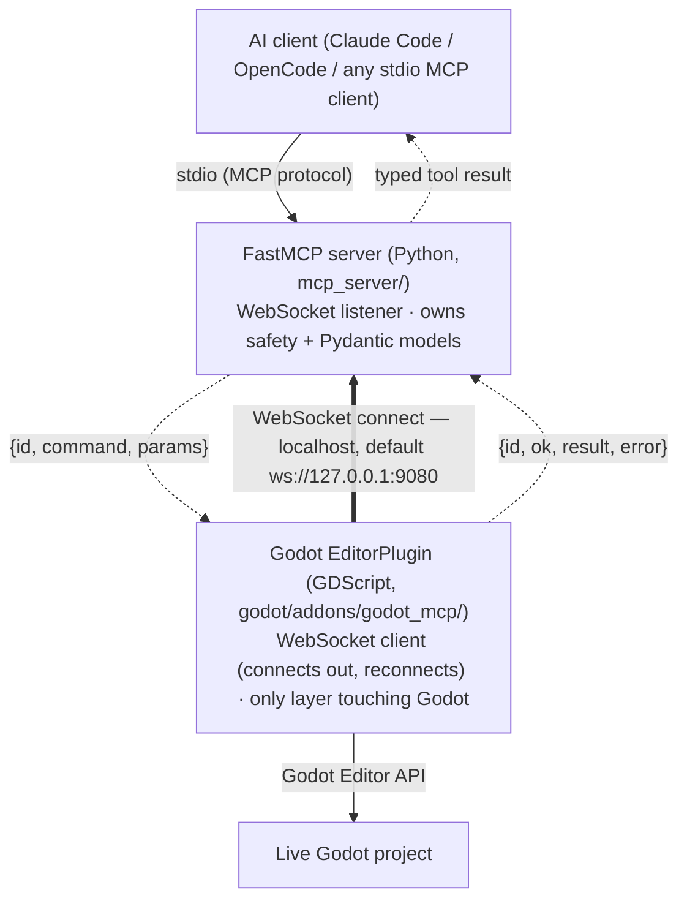

# Architecture: the WebSocket bridge contract

This document is the contract for the seam between the two halves of godot-mcp. It is
authoritative for the **transport** and the **JSON envelope**; the tool/resource/prompt
surface is specified in [`tool-contracts.md`](tool-contracts.md). The grounding rules in
[`../.opencode/rules/`](../.opencode/rules/) govern *how* code on each side is written.

> Status: the bridge is implemented (issue #3) with the connection direction inverted
> (#276): the **server listens, the editor connects out**. Server side:
> `mcp_server/bridge.py` (async WebSocket *listener*, `id` correlation, timeout) over the
> envelope models in `mcp_server/models/envelope.py`. Addon side: `mcp_bridge.gd`
> (`WebSocketPeer` *client* that connects out and reconnects with backoff) routing through
> `command_router.gd`. `cmd_ping` → `{pong: true}` is the health check. Higher-level
> `cmd_*` handlers and MCP tools build on this contract.

## The four-layer transport chain

Every agent action crosses all four layers:



The bold arrow is the **transport** connection the editor initiates (and reconnects);
once it is up, the **server still initiates every command** (dashed `{id, command, …}`)
and the addon responds — the request/response direction is unchanged, only who dials.

- **MCP server** (`mcp_server/`) is the WebSocket **listener** and the AI-facing stdio
  server. It owns all safety, permission, and precondition logic and the Pydantic domain
  models. It holds no Godot logic. It binds the bridge port and waits for the editor.
- **Godot addon** (`godot/addons/godot_mcp/`) is the WebSocket **client**: a
  `WebSocketPeer` that connects out to the server and reconnects with backoff (the editor
  is the party that comes and goes, so it owns reconnection — #276). It is the only code
  that touches the Godot Editor API.

Direction of control: the **server initiates** every command; the addon responds. The
addon never pushes unsolicited commands. (Editor-event streaming, if added later, will be
a separate, explicitly-versioned channel.)

## Transport

- **URL:** `ws://127.0.0.1:9080` by default. Configurable on both sides (server:
  `GODOT_MCP_BRIDGE_URL`; addon: same env var) — never hard-coded in library code.
  localhost-only, **no auth in v1**.
- **Framing:** one JSON object per WebSocket text message. UTF-8.
- **Connection lifecycle:** the **server listens; the editor (addon) connects out and
  reconnects** with **exponential backoff** (start ~500 ms, capped) whenever the link is
  down — so editor start order doesn't matter and a restart self-heals (#276). At most one
  active peer; a new connection replaces the old. A `cmd_ping` → `{pong: true}` exchange is
  the liveness health check.
- **Concurrency:** many requests may be in flight; each response is matched to its request
  by `id`. Correlation is concurrency-safe — no shared mutable per-request state. The
  editor is a single writer, so mutating commands are effectively serialized by the addon.

## The JSON envelope (versioned from day one)

### Command — server → addon

```json
{ "id": "uuid-or-monotonic-string", "command": "cmd_create_node", "params": { "...": "..." } }
```

| Field | Type | Notes |
|-------|------|-------|
| `id` | string | Unique per request; the response echoes it. |
| `command` | string | An addon handler name, always `cmd_<verb>_<noun>`. |
| `params` | object | Command arguments. Godot types are JSON-coerced (see below). |

### Response — addon → server

Success:

```json
{ "id": "…", "ok": true, "result": { "...": "..." } }
```

Failure:

```json
{ "id": "…", "ok": false, "error": "RESOURCE_NOT_FOUND", "hint": "No node at 'Player/Gun'." }
```

Precondition failure (richer form, so the agent knows what to satisfy):

```json
{ "id": "…", "ok": false, "error": "PRECONDITION_FAILED",
  "hint": "Open a scene before creating nodes.", "required": "active_scene" }
```

| Field | Type | Notes |
|-------|------|-------|
| `id` | string | Echoes the command `id`. |
| `ok` | bool | `true` ⇒ `result` present; `false` ⇒ `error` + `hint` present. |
| `result` | object | Present only when `ok: true`. JSON-safe types only. |
| `error` | string | Present only when `ok: false`. A **stable, enumerated** code. |
| `hint` | string | Present only when `ok: false`. Actionable for an agent with no human in the loop. |
| `required` | string | Only on `PRECONDITION_FAILED`: the precondition to satisfy. |

### Rules

- **Correlate by `id`.** A response with an unknown or missing `id` is dropped and logged.
- **Never leak a trace.** A GDScript runtime error or a Python exception is caught at the
  bridge boundary on its own side and converted to an `ok: false` envelope.
- **Stable error codes only**, drawn from the enumerated set below — never ad-hoc strings.
- **A timed-out request resolves to a `TIMEOUT` envelope**; it never hangs the agent.
- **No partial success.** Half-completed work returns `ok: false`, not `ok: true` with a
  truncated `result`.

### Enumerated error codes (v1)

| Code | Meaning |
|------|---------|
| `PRECONDITION_FAILED` | A required condition (e.g. `active_scene`) is not met; see `required`. |
| `RESOURCE_NOT_FOUND` | A referenced node/scene/resource does not exist. |
| `VALIDATION_ERROR` | Params failed schema/type validation. |
| `BRIDGE_DISCONNECTED` | The addon is not reachable. |
| `TIMEOUT` | No response within the request's timeout. |
| `INTERNAL_ERROR` | An unexpected failure on either side (still structured, never a trace). |

This table is the source of truth for the error enum; extend it here (and in the
contract tests) before adding a new code.

## Type coercion

Godot types cross the bridge as JSON-safe forms, coerced on the addon side in the
dedicated `type_coerce.gd` helper (`MCPTypeCoerce`), never inline. The read direction
(Godot → JSON) landed in issue #5; the write direction (`from_json`, using each property's
declared type to reconstruct the Godot value) landed with the mutation tools in issue #6.
`from_json` also accepts agent-friendly **string forms** (issue #51): `"Vector2(100, 200)"`,
`"Rect2(0, 0, 4, 5)"` (via `str_to_var`), and HTML/hex colors `"#ff0000"` / `"#ff0000ff"`
(via `Color.html`), in addition to the dict/array forms below.

| Godot type | JSON shape |
|------------|------------|
| `Vector2` / `Vector2i` | `{ "x": float, "y": float }` |
| `Vector3` / `Vector3i` | `{ "x": float, "y": float, "z": float }` |
| `Color` | `{ "r": float, "g": float, "b": float, "a": float }` |
| `Rect2` / `Rect2i` | `{ "position": {x,y}, "size": {x,y} }` |
| `NodePath` / `StringName` | string |
| `Resource` | its `resource_path` (else the class name) |
| `Array` / packed arrays / `Dictionary` | coerced element-wise |
| `null`, `bool`, `int`, `float`, `String` | passed through unchanged |

Scene trees serialize to `{ name, type, script, children }` and honor a `max_depth`
parameter (`-1` = unlimited, `0` = the node with no children). Node detail serializes to
`{ node_path, type, script, properties, children }` (see [`tool-contracts.md`](tool-contracts.md)).

## Runtime execution (issue #13)

The `godot_runtime_run_and_capture` tool is the one place the server launches a **Godot process
directly** (`godot --headless --path <project> [scene]`) rather than going through
the bridge. This is a deliberate, reasoned exception to "the bridge is the only path
to Godot" (Article II): running the game for verification is *process execution*,
not *editor control*, and Godot exposes no public GDScript API to read the editor's
Output/error log, so the addon cannot capture a separate game process's stdio. The
bridge stays the only path for editor control; the runner is isolated in
`mcp_server/runtime.py` with an injected subprocess so it stays testable. The runner also
drives `godot_export_project` (issue #50) — `godot --headless --export-release|--export-debug` —
for the same reason (process execution, not editor control).

## Runtime session bridge (issue #66)

To inspect or drive a *running* game (issues #35 inspection, #36/#68 input, #38 profiling),
the game must be launched **from the editor** so it connects back to the editor's remote
debugger — a fifth interaction path, distinct from the headless subprocess above:

```
server ──cmd_play_scene──> addon ──EditorInterface.play_*──> game process
game ──EngineDebugger("godot_mcp:…")──> editor debugger ──> MCPDebugger (EditorDebuggerPlugin)
```

Why this shape: a custom `EditorDebuggerPlugin` only receives messages with its own prefix
and there is no public API to read the engine's built-in remote scene tree, so live
interaction needs **game-side cooperation**. The consuming project opts in by adding the
shipped `addons/godot_mcp/mcp_runtime_probe.gd` as an **autoload**; it registers an
`EngineDebugger` capture on the `godot_mcp:` channel and answers queries (scene tree,
property samples, find-UI, input injection, performance monitors).

- `mcp_debugger.gd` (`MCPDebugger`, an `EditorDebuggerPlugin` added in `_enter_tree`)
  captures the channel, tracks session start/stop, and **caches** the probe's replies.
- Because the WebSocket bridge is synchronous (one request → one response), the round-trip
  to the running game is **poll-and-cache**: a command sends a request to the probe and
  returns the latest cached reply; the MCP tool polls until the result is fresh (a
  `request_id` for find-UI; a clear-on-new for property samples). This avoids making the
  core bridge async.
- Without the probe autoload, runtime tools return `connected: false` (with a hint) or a
  `PRECONDITION_FAILED` (`required: play_session` / `runtime_probe`) — never a hang.

## Health check

`ping` → `pong` is the canonical liveness probe and the first contract test (issue #3).
The server's `godot_health_check` tool (issue #4) reports server version plus bridge connection
state, built on this probe.

## MCP surface capabilities (auto-discovery)

The server exposes its full surface through multiple MCP protocol features so agents can
discover capabilities without hard-coding knowledge:

- **Server instructions** — sent automatically on every MCP client connect. Explains the
toolset gating protocol, common toolsets, docs URLs, and prompt names.
- **`experimental_capabilities.godot_mcp`** — structured metadata in the server init handshake
with version, min_godot, toolset_count, docs URIs, prompt names, and resource URIs.
- **Prompts** — `@mcp.prompt()` workflow templates (toolset_discovery, build_scene,
play_test, script_edit, debug_scene, troubleshoot). Discoverable via `list_prompts()`,
renderable via `render_prompt()`.
- **Resources** — `godot://project/info`, `godot://scene/current`, `godot://scene/tree`,
`godot://node/selected`. Read-only snapshots refreshed on access.
- **`godot_get_server_info`** — a single `core` tool that returns everything: toolset summaries
with per-category tool counts, prompt/resource lists, bridge state, active scene, 8 common
errors with fixes, and suggested next steps.
