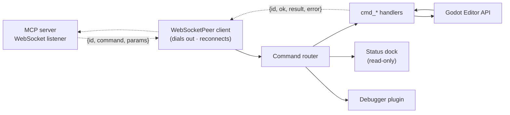

# The Godot addon

The addon (`godot/addons/godot_mcp/`) is the **only** part of the system that
lives inside Godot and the only code that touches the Godot Editor API. It is a
plain `EditorPlugin` (`@tool`) that installs under `res://addons/godot_mcp/` and
joins the editor to the MCP server. Everything else — the reasoning, the
per-tool contract, and the safety model — lives on the [server](index.md) side.

See [Install the Godot addon](../getting-started-addon.md) for setup; this page
is the architecture of what you installed.

## What it is, in one picture

The server **initiates every command**; the addon responds. The addon never acts
unprompted.

## The connection: it dials out

The addon embeds a `WebSocketPeer` **client** that connects **out** to the
server's bridge listener (default `ws://127.0.0.1:9080`, configurable via
`GODOT_MCP_BRIDGE_URL` on both sides). This inversion (#276) is deliberate:

- **Start order never matters.** Editor first, server first — whoever comes
  second connects.
- **Restarts don't wedge.** The addon reconnects with exponential backoff
  (≈500 ms, doubling, capped), so a bounced server or a restarted editor
  recovers on its own.
- **A second editor is handled honestly.** When another instance takes over the
  bridge, the replaced editor gets a `PEER_REPLACED` notice and shows a distinct
  **"Replaced by another editor"** state (purple dot) instead of a misleading
  green, and stops reconnecting.

The transport details (auth, buffer sizes, the control-message pushes) are in
[Bridge & transport](bridge.md) and the [JSON envelope](envelope.md).

## Command routing

Every incoming envelope is one JSON object; a single **command router**
(`command_router.gd`) dispatches it to a `cmd_<verb>_<noun>` handler that calls
the Godot Editor API and returns a correlated `{id, ok, result, error}` response.

- **Handlers are per-domain**, registered data-driven from a table (32 domain
  handler scripts under `handlers/`), plus the router's own core commands
  (undo/redo/history, batch, handshake). One handler does one thing.
- **A handler that dies on a GDScript error** answers `INTERNAL_ERROR` rather
  than leaving the server to time out (#466).
- **Nothing is guessed.** The router is the only place command strings resolve;
  the server's handshake surface mirrors its registered-command list.

!!! note "Why the addon holds no safety logic"
    Preconditions, `dry_run`/`confirm`, gating, and permission decisions all
    live in the server (see [The safety model](safety.md)). The addon performs
    the editor operation it is asked to, undo-tracked and serialized. This keeps
    it game-agnostic — it knows Godot, not your game.

## Mutations are undoable

Every create, rename, delete, or property set registers with
**`EditorUndoRedoManager`**, so a human can revert any agent action with
**Ctrl+Z**. Destructive handlers honor the `confirm` flag the server enforces.
Batches above the 20-node undo threshold report `undoable: false` with a hint
rather than pretending the undo stack covers them.

## Everything returned is JSON-safe

Scene trees, node data, and properties serialize to plain JSON. Godot types
(`Vector2/3`, `Color`, `Rect2`, `NodePath`, resources) are coerced by a single
shared helper, `type_coerce.gd` — never inline, never duplicated. A handler
error becomes an `ok: false` envelope with a stable code and an actionable
hint, never a raw engine trace.

## The status dock

Enabling the plugin adds a **read-only** status panel at the bottom of the
editor (alongside Output and Debug). It is a dumb `Control` fed by the plugin —
it holds no Editor API knowledge and never mutates the project, which is what
makes it verifiable headlessly. It shows:

| Row | Shows |
|-----|-------|
| Connection | colour dot + state — Connected / Connecting / Disconnected / **Replaced** |
| Server / Godot | the server's CalVer once the handshake lands, and the editor version |
| Bridge | the bridge URL |
| Scene | the active scene, marked `main.tscn ●` when the editor holds unsaved edits |
| Selected | the selected node |
| Last action | the most recent undoable change — *"create_node 'Player' (Ctrl+Z to undo)"* |
| Playing | the running scene + whether the runtime probe is attached |
| Toolsets | the enabled set, pushed by the server (honestly `(unknown)` before the first push) |
| Recent commands | an outcome-bearing log (✓ success, ✗ **error code**) with a per-session count and a **Copy** button |

Reconnect attempts and server notices (auth refusal, a peer replacement) share
the same log, so a flapping or taken-over link explains itself. The dock reflects
state; it never drives it.

## Live runtime: the debugger plugin + probe

Two optional pieces let the agent see a **running** game, not just the editor:

- A **debugger plugin** (`mcp_debugger.gd`) registers with the editor's debugger
  and captures the `godot_mcp:` channel — the live scene tree, game output, and
  the break/step/stack surface.
- A **runtime probe** (`mcp_runtime_probe.gd`) that you add as an autoload **in
  your game's project**. It runs in the game, no-ops outside a debug session, and
  is safe to leave enabled. With it, live input simulation, property monitoring,
  and UI-element discovery work; without it, those calls return a clear
  precondition failure — never a silent no-op.

See [Play-test & debug](../guides-playtest-debug.md) for the loop.

## What the addon owns vs. the server

| The addon owns | The server owns |
|----------------|-----------------|
| the Godot Editor API, `EditorUndoRedoManager` | safety classes, preconditions, `dry_run`/`confirm` |
| `WebSocketPeer` client, reconnection/backoff | the WebSocket **listener**, one active peer |
| JSON-safe serialization (`type_coerce.gd`) | Pydantic result models, the tool surface |
| the status dock, the debugger plugin | toolset gating, contract versioning |
| `cmd_*` handlers | MCP tools / resources / prompts |

The seam is the versioned JSON envelope. Keep it clean: **only the addon touches
Godot; only the server owns safety.**
