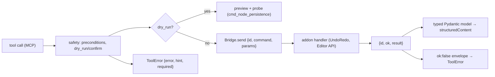

# The JSON envelope

Every message across the bridge is a versioned JSON envelope. Failures are
structured data an agent can act on — never a stack trace, never silent.

## Shapes

```jsonc
// server → addon (command)
{ "id": "42", "command": "cmd_create_node", "params": { "parent_path": ".", "node_type": "Node2D", "name": "Player" } }

// addon → server (success)
{ "id": "42", "ok": true, "result": { "node_path": "Player", "created": true, "persisted": true } }

// addon → server (failure)
{ "id": "42", "ok": false, "error": "RESOURCE_NOT_FOUND", "hint": "No node at 'Player/Gun'." }

// precondition failure — the richer form the agent can act on
{ "id": "42", "ok": false, "error": "PRECONDITION_FAILED", "hint": "Open a scene before creating nodes.", "required": "active_scene" }
```

## Rules

1. **Correlate by `id`.** Every response carries the command's `id`; the
   server keeps one waiter per in-flight command, so many commands can be
   in flight concurrently without cross-talk.
2. **Stable error codes.** Failures use the enumerated `ErrorCode` set:
   `PRECONDITION_FAILED`, `RESOURCE_NOT_FOUND`, `VALIDATION_ERROR`,
   `BRIDGE_DISCONNECTED`, `TIMEOUT`, `INTERNAL_ERROR`, `APPROVAL_DENIED`. No
   ad-hoc strings — clients match on the enum, not on prose.
3. **`hint` is for recovery**, written for an agent with no human in the loop:
   "Enable Editable Children on 'Relic', or target a node the scene owns" —
   not a restatement of the code.
4. **Preconditions carry `required`** — the machine-checkable name of what to
   satisfy: `active_scene`, `confirm`, `bridge_connected`, `runtime_probe`,
   `game_not_breaked`, `godot_version`, `project_dir`.
5. **Catch at the boundary, both sides.** A GDScript runtime error inside a
   handler becomes `{ok: false, error: INTERNAL_ERROR, hint: "…failed inside
   the addon…"}`; a Python exception becomes a FastMCP `ToolError` with the
   same discipline. Raw traces never reach the client.
6. **Never a partial success** — `{ok: true}` when the effect half-failed is
   the anti-pattern the persistence and readiness systems exist to prevent.

## Where the shapes live

| Side | Module |
|------|--------|
| Server models | `mcp_server/models/envelope.py` (`CommandEnvelope`, `ResponseEnvelope`, `ErrorCode`) |
| Addon builders | `command_router.gd` `_ok()` / `_fail(code, hint, required?)` |
| Tool shaping | `mcp_server/tools/_route.py` (`route()`, `run_or_preview()`, `poll_ready()`) |

The envelope shape is pinned by contract tests (a fake addon peer asserts the
wire bytes); a shape change without a contract-test update is a drift bug by
the repo's own rules.

## From envelope to MCP result



Every tool returns a **typed Pydantic model** — never a raw dict. FastMCP
serializes the model into `structuredContent` on the MCP response, so a client
gets machine-parseable JSON (with the text fallback for other servers).

## Versioning the envelope

The envelope is versioned from day one and has been shape-stable since the
first PR: additive keys (`persisted`, `reason`, `hint`, `required`,
`scanning`, …) never break a client, because clients ignore unknown fields.
That is why `contract_version` has stayed at **1** through every release while
the surface grew 186 tools. A *breaking* change (removed/renamed key, changed
required param) would bump it — and `godot_get_server_info` carries the
counter so clients can negotiate.