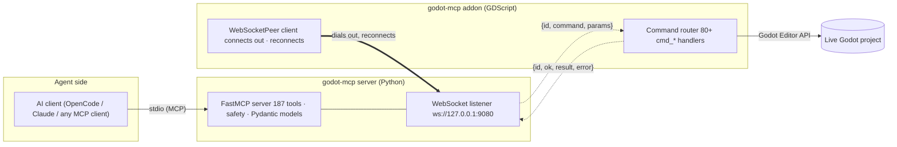

# Architecture

godot-mcp is two halves joined by one seam. Keep the seam clean; keep logic out
of the handlers.

The bold arrow is the **transport** — the editor dials out and reconnects. Once
connected, the **server still initiates every command**; the addon responds.
The direction of control never changed, only who dials.

## Pages in this section

- [The four-layer transport chain](index.md) — this page
- [Bridge & transport](bridge.md) — lifecycle, backoff, timeouts, config
- [The JSON envelope](envelope.md) — command/response shapes, error codes, id correlation
- [Toolset gating](gating.md) — the enabled set, list_changed, version gates
- [The safety model](safety.md) — classes, preconditions, dry_run/confirm, where safety lives
- [Persistence truth](persistence.md) — the owner chain, parent rule, per-target verdicts
- [The readiness envelope](readiness.md) — reason tokens, poll_ready, why nothing stalls silently

## The layers

| Layer | Where | Owns | Never touches |
|-------|-------|------|---------------|
| AI client | any MCP host | tool selection, prompt context | Godot, the bridge |
| MCP server | `mcp_server/` (Python 3.11+, FastMCP) | safety, preconditions, Pydantic models, tool surface, the WebSocket **listener** | the Godot editor API |
| Godot addon | `godot/addons/godot_mcp/` (GDScript, `@tool`) | the Godot Editor API, UndoRedo, serialization, reconnection | safety decisions, permissions |
| Godot | the running editor + project | game state | — |

Two rules keep the seam clean:

1. **Library-first**: tool/resource/prompt handlers are *delegation only* —
   validate, call a service or the bridge, return a typed model. Zero domain
   logic in the handler body. Reusable logic lives in `bridge.py`,
   `safety.py`, and `mcp_server/models/`.
2. **Service isolation**: the bridge client is the only way Python talks to
   Godot; the server owns all safety; the addon owns all Godot API calls.
   Neither crosses into the other.

## Why four layers at all?

A thinner design (client → addon directly) would skip the MCP server, but then
safety, gating, and typing would live in GDScript, version-locked to the
editor, and unshareable across stdio/HTTP clients. A thinner one (client →
Godot over a socket, no Python) loses typed models and the eval/skill ecosystem
that runs on the Python side. The four-layer shape lets each half evolve on its
own Cadver/contract terms: the addon pins Godot APIs, the server pins the MCP
protocol, and the envelope is the versioned glue.

The bridge seam is also the test boundary: the entire suite (819 tests) runs
against a fake addon connection — no sockets, no editor, deterministic — and a
separate live-e2e suite exercises the real editor on a self-hosted runner.

## The data path, end to end

1. The agent calls `godot_scene_edit_create_node(parent_path=".", node_type="Node2D", node_name="Player")` over stdio.
2. FastMCP resolves the tool (transform maps the exposed name to the handler),
   runs safety: `active_scene` precondition, safety-class params.
3. The server writes `{id, command: "cmd_create_node", params}` to the WebSocket.
4. The addon's router dispatches to the `cmd_create_node` handler: resolves the
   parent, probes the persistence verdict, registers the create with
   `EditorUndoRedoManager`, commits.
5. The handler returns `{id, ok, result: {node_path, created, persisted, …}}`.
6. The server builds a typed Pydantic model (`CreateNodeResult`), FastMCP
   serializes it as `structuredContent` on the MCP response.
7. The agent reads `persisted: true` and proceeds — or reads
   `persisted: false, reason: instanced_child_not_editable` and acts on the
   hint (enable Editable Children, retarget, …).

Each numbered hop has a contract test pinning its shape.