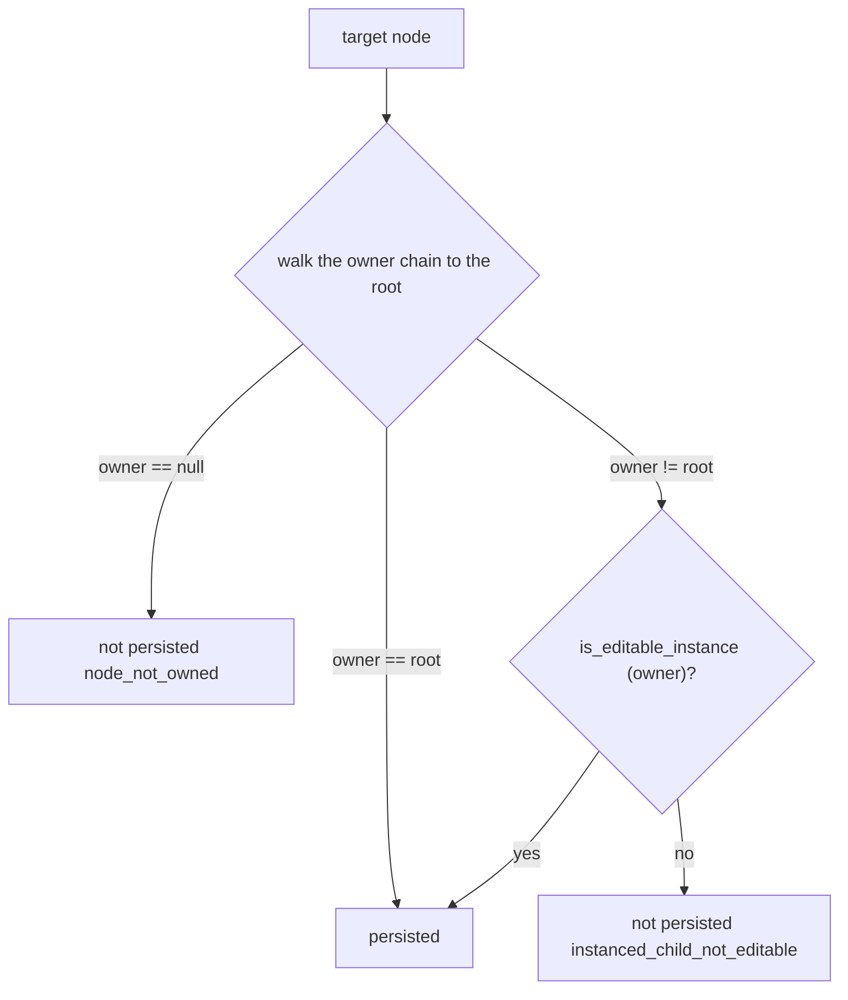

# Persistence truth

The engine's save rules are subtle: Godot packs a node only when its `owner`
is the edited root or an editable instance, and **a skipped node's subtree is
never visited**. So a change that applies live in the editor can silently
vanish on save — the worst outcome for an agent that trusts `ok: true`.

The persistence system stamps every mutation result with what a save will
keep:

```jsonc
{
  "node_path": "Relic/Cold/Extra",
  "created": true,          // the change applied live
  "persisted": false,       // but the save will drop it
  "reason": "instanced_child_not_editable",
  "hint": "'Relic/Cold' is inside the instanced scene 'Relic', which does not
           have Editable Children enabled — the change shows in the editor but
           will not be saved. Enable Editable Children on 'Relic', or target a
           node the scene owns."
}
```

## The rule

`_persistent_target(node)` (in `command_router.gd`) mirrors 4.7's
`SceneState::_parse_node`:



Reasons are stable tokens the agent can match on:

| Token | Cause |
|-------|-------|
| `node_not_owned` | no owner in the edited scene (e.g. added by a `@tool` script) |
| `instanced_child_not_editable` | inside an instanced scene without Editable Children |
| `embedded_in_other_resource` | the edit reaches through a resource embedded in another scene, never re-saved |
| `group_from_base_scene` | the group an instanced/inherited scene gives the node is back after reload |

## The deciding rule per mutation family

A change is saved only when the packer *visits* the changed node, so the
verdict keys on the **nearest ancestor the packer actually writes**:

| Family | Keys on | Why |
|--------|---------|-----|
| creates / instances / duplicates / compose | the **parent** | the target does not exist yet; if the parent is skipped, the whole new node is lost |
| `move_node` | the **destination parent** | a node moved into a non-editable instance is lost; the removal from an owned source saves fine |
| `delete_node` | the **node itself** | an instance-owned node is restored by the instance on reload; an unowned node was never packed |
| property edits / resources | the node, then the resource chain | a sub-resource saves with its node; a resource file saves itself; a sub-resource of another scene is never re-saved |

## Previews agree with reality

A `dry_run` preview carries the same verdict as the real run. The tool sends
the read-only `cmd_node_persistence` probe (target path, plus the
`resource_properties` the real handler would follow, or `probe_parent` /
`probe_parent_of` for structural edits), and the addon runs the *same* rule.
The probe and the real handler always agree — the e2e suite asserts
preview == real == saved file for every family.

## Per-target verdicts for batches

`batch_set_property` and `apply_node_edits` target resolution **descends into
instanced children**, so their `applied[]`/`edited[]` entries are not uniformly
persistent. The batch result carries a `persistence[]` array — one
`{node_path, persisted, reason?, hint?}` entry per applied target. A batch is
never "ok" in a way that hides a lost target.

## The dead end, closed

`instanced_child_not_editable` hints used to say *"Enable Editable Children on
'&lt;instance&gt;'"* with no tool to do it. [2026.09.19](../changelog.md) added
`godot_scene_edit_set_editable_children` — the action the verdict names — and
the scene tree now marks instanced nodes with `owner` /
`editable_children: true` so the agent can *see* the situation before acting.

## Where it is enforced

- **Addon**: `_persistent_target`, `_resource_persistence`,
  `_group_removal_persistence` in `command_router.gd`; every Tier-1/2/3
  handler stamps via `_with_persistence`.
- **Previews**: `mcp_server/tools/_persistence.py` builders (`node_probe`,
  `animation_probe`, `parent_of_probe`) — the single source of truth for the
  probe the tool sends.
- **e2e**: `test_persistence_e2e.py` — preview == real == saved file for
  ~40 operations across instanced, inherited, and resource-chain cases.
- **Contract version**: additive fields only; `contract_version` stays 1.