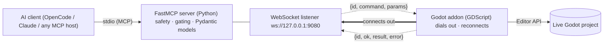

## The data path, end to end

Every agent action crosses four layers — each hop is contract-tested:



The bold arrow is the transport — the editor dials out and reconnects, so
launch order never matters. Once connected, the **server still initiates every
command**; the addon responds.

## The proof in one call

Ask the agent to create a node under an instanced scene child:

```text
> godot_scene_edit_create_node(parent_path="Relic/Cold", node_type="Node", name="Extra")

{ "node_path": "Relic/Cold/Extra", "created": true,
  "persisted": false,
  "reason": "instanced_child_not_editable",
  "hint": "'Relic/Cold' is inside the instanced scene 'Relic', which does not
           have Editable Children enabled — the change shows in the editor but
           will not be saved. Enable Editable Children on 'Relic', or target a
           node the scene owns." }

PROOF: a file-blind agent would believe the node was created. The verdict
names the failure AND the fix — and godot_scene_edit_set_editable_children
is the action the hint names.
```

Run it yourself: [getting started](./getting-started) — the whole surface is
additive and pinned by contract tests.

> [!WARNING]
> **Contract version 1** — clients negotiate via
> `godot_get_server_info`'s `contract_version` / `min_compatible_contract`.
> Additive changes never break a client; removals and renames bump the counter.

---

## Where to go next

- **[What & why](./what-why)** — the reasoning behind every major design decision
- **[Core concepts](./concepts)** — the five ideas the rest of the docs assume
- **[Architecture](./architecture/)** — the bridge, the envelope, gating, safety, persistence, readiness
- **[Reference](./reference)** — every tool, safety class, value shape, error code, env var
- **[Guides](./guides)** — build a scene, play-test and debug, verify your work